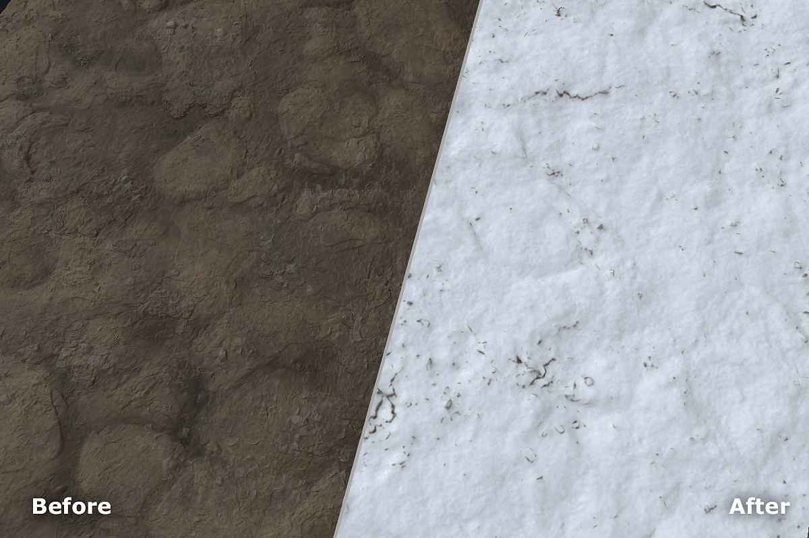

# 雪

<table>
<tr style="border: 0;">
<td width="41.60%" style="border: 0;" valign="top">

**イン：**&#x200B;摩耗と仕上げ

</td>
<td width="58.30%" style="border: 0;" valign="top">

## 説明

**Snowフィルター**&#x200B;を使用すると、粉塵から数フィートの雪まであらゆるものを素材に加えることができます。

</td>
</tr>
</table>

## パラメーター

**基本パラメーター**

* **ランダムシード**:\
  ランダムシードは、このフィルターのランダム度を使用する他のパラメーターのランダム値を決定します。
* **新しいSnow**: 0 ～ 1\
  雪の量を変更します。
* **溶けたSnow**: 0-1\
  雪が溶ける量をコントロールします。 このパラメータは非常に感度が高い。
* **ビルドアップ**: 0 ～ 1\
  雪が積もった時間を調整します。 これにより、基本となるHeightの詳細が不明瞭になります。
* **Smoothness**: 0 ～ 1\
  雪の滑らかさを調整します。 これを上げると、下にあるHeightのディテールが不明瞭になり、雪がよりソフトで深く見える場合があります。
* **フレークの適用度**: 0 ～ 1\
  個々の雪片の見え方を調整します。
* **カスタムマスクを使用**：切り替え\
  カスタムマスクの使用を有効または無効にします。 有効にすると、次のパラメーターが表示されます。
  * **カスタムマスク**：画像/ブラシ\
    マスクとして使用する画像を選択するか、ブラシを使用して2Dビューでカスタムマスクを直接ペイントします。
  * **マスクぼかし**: 0-1\
    マスクをぼかします。
  * **マスクの適用度**: 0 ～ 1\
    マスクの不透明度を調整します。
