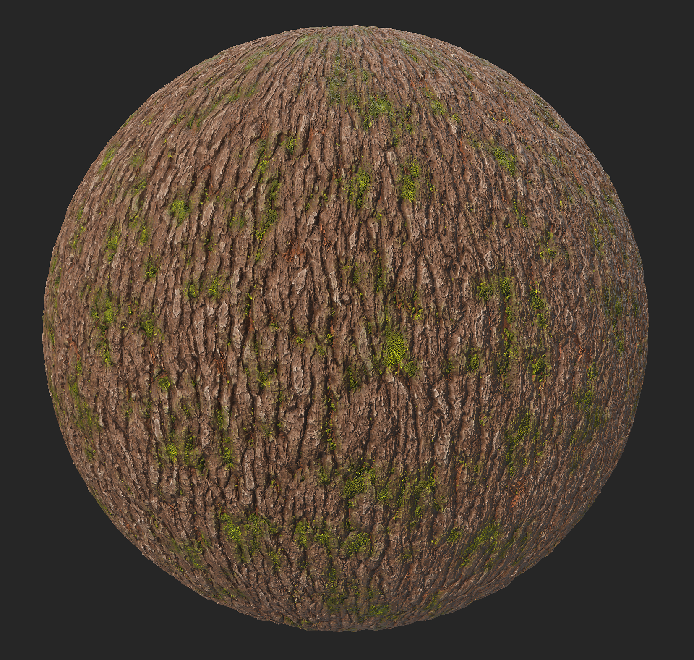
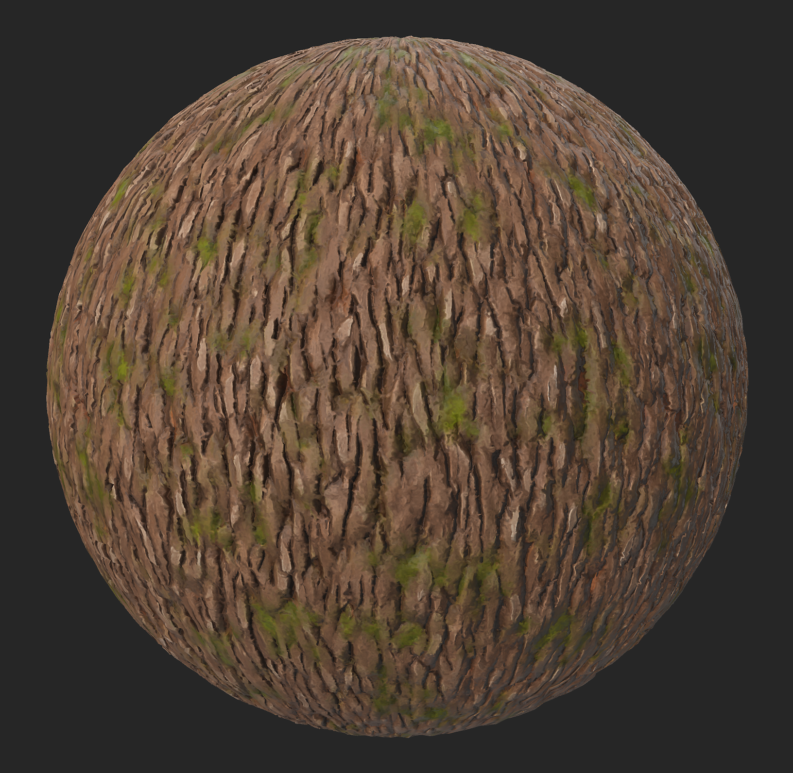

# スタイル化

<table>
<tr style="border: 0;">
<td width="41.60%" style="border: 0;" valign="top">

<b>イン：</b>摩耗仕上げ

</td>
<td width="58.30%" style="border: 0;" valign="top">

## 説明

<b>スタイル設定フィルター</b>を使用して、マテリアルの外観を変更し、様々な効果を使用して細部を単純化します。

以下の画像は、表現手法フィルターを適用する前と後の樹皮の材質を示しています。

</td>
</tr>
</table>

## プリセット

<b>スタイル化</b>

    初期設定のプリセットは、細かいディテールをぼかしてコントラストを上げることで、ソフトなスタイル化効果を適用します

<b>対比スタイル化</b>

    このプリセットでは、ブラシのような効果をマテリアルに適用します

<b>画家風</b>

    このプリセットは、マテリアルにぼやけたソフトなブラシストロークのような効果を適用します

<b>手描き</b>

    このプリセットは、以前のプリセットよりもコントラストが強く、ガッシュやオイルペイントの手動ブラシストロークに似ています

## 基本パラメーター

* <b>ランダムシード</b>\
  このフィルタの他のすべてのランダムパラメータの基準となるランダムシード。

* <b>全体的なフィルターの適用度</b>: 0 ～ 1 \
  このフィルターの効果を元のマテリアルに適用する度合いを調整します。 1に設定すると、効果全体が適用されます。

* <b>コントラスト</b>: 0 ～ 1 \
  マテリアルに適用されるコントラストのレベルを変更します

* <b>色のスタイル設定の適用度</b>: 0 ～ 1 \
  フィルターのスタイル設定の効果がマテリアルのカラーに与える影響の度合いを調整します

* <b>粗さのスタイル設定の適用度</b> : 0 ～ 1 \
  フィルターのスタイル設定の効果がマテリアルのラフネスに与える影響を調整します

* <b>メタリックスタイルの適用度</b>: 0 ～ 1 \
  フィルターの表現効果がマテリアルのメタライズに与える影響を調整します

* <b>Heightのスタイル設定の適用度</b>: 0 ～ 1 \
  フィルターのスタイル設定の効果がマテリアルのHeightに与える影響を調整します

* <b>通常のスタイル設定の適用度</b>: 0 ～ 1 \
  フィルターのスタイル設定の効果がマテリアルの法線にどの程度影響するかを設定します

## ベースカラー

* <b>カラー化の適用度</b>: 0 ～ 1 \
  より鮮明なカラー

* <b>色の変更</b>:カラー \
  「カラー化の適用度」パラメーターが影響を与える色を選択できます。

* <b>カラーバリエーションの適用度</b>: 0 ～ 1 \
  「カラーバリエーション」で定義されたカラーがカラーの強さに影響を与える度合いを調整します。

* <b>カラーバリエーション</b>:カラー \
  「カラーバリエーションの適用度」スライダーを使用するカラーを選択します。

* <b>カラーバリエーションのコントラスト</b>: 0-1 \
  「カラーバリエーション」で定義されたカラーのコントラストを調整します

* <b>キャビティの色の適用度</b>: 0-1 \
  マテリアルの暗い領域に表示されるカラーの強さを調整します。このカラーは、「キャビティのカラー」で定義されています

* <b>キャビティの色</b>:カラー \
  マテリアルの暗い領域に適用されるカラーを指定します

* <b>キャビティの範囲</b>: 0 ～ 1 \
  マテリアル領域の下の部分の幅を指定します。

* <b>空洞ぼかし</b>: 0-1\
  マテリアルの空洞のエッジ部分のぼかしレベルを調整します

* <b>曲率の強さ</b>: 0 ～ 1 \
  マテリアルの最も高い点が表示される度合いを変更し、「曲率カラー」パラメータで定義されたカラーで色付けします

* <b>曲率のカラー適用度</b> : 0 ～ 1 \
  「曲線カラー」パラメーターで定義されたカラーの不透明度を調整

* <b>曲率の色</b>:カラー \
  マテリアルの最も高い点に適用されるカラーを指定します

* <b>曲率ぼかし</b>: 0 ～ 1 \
  「曲率カラー」パラメーターでカラーを設定した領域の周囲のぼかしレベルを調整

## 汚れ

* <b>経年劣化の適用度</b>: 0 ～ 1 \
  マテリアル上に経年劣化マップを追加します。 経年劣化マップは以下から選択できます。

* <b>経年劣化の色</b>:カラー \
  選択した経年劣化マップの適用に使用する色を選択します

* <b>ラフネス</b>: 0 ～ 1 \
  追加された経年劣化マップに適用されるレベルまたは粗さを調整します

* <b>経年劣化</b>: 0 ～ 1 \
  追加された経年劣化マップに適用されるメタルのレベルを調整します

* <b>ラフネスのバリエーション</b>: 0 ～ 1 \
  追加された経年劣化マップに適用されるラフネスのバリエーションのレベルを選択

* <b>ラフネスの変動の強さ</b>: 0 ～ 1 \
  追加された経年劣化マップに適用される変動の強さの変動レベルを選択します

* <b>経年劣化</b>：画像 \
  経年劣化マップとして使用する画像またはSamplerアセットライブラリで使用可能なテクスチャジェネレーターを選択します

## 技術パラメーター

* <b>シャープの強さ</b>: 0 ～ 1 \
  グローバルシャープ効果の適用度を調整

* <b>シャープの半径</b>: 0 ～ 1 \
  グローバルシャープ効果の半径を調整

* <b>法線を再計算</b>：切り替え \
  マテリアルに適用された変更に従って、Samplerが法線を再計算できるようにします

* <b>法線の強度</b>: 0 ～ 1 \
  法線マップの適用度を調整

* <b>通常のソフト</b>: 0 ～ 1\
  マテリアルを滑らかに見せるために、法線をソフトにします

* <b>Ambient occlusionの強さ</b>: 0 ～ 1\
  AOマップのコントラストのレベルを調整します
