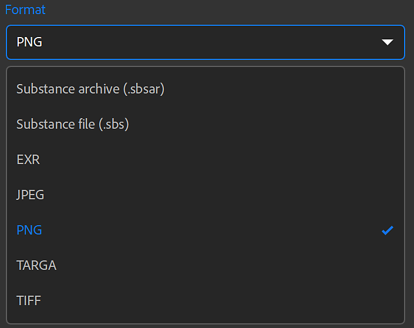
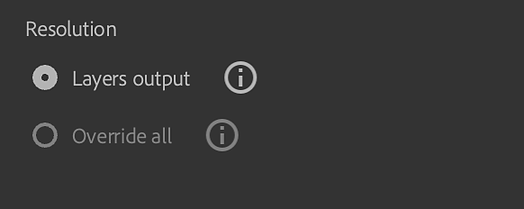

# 書き出しウィンドウ

<b>右側のバー</b>の<b>書き出し</b>パネルからアセットを書き出すことができます。

書き出しオプションは、書き出すアセットの種類によって異なります。

マテリアルの書き出しの書き出しウィンドウ。

>[!NOTE]
>
> 書き出しパネルには、アセットをSubstance 3D Designer、Painter、またはStagerに送信するオプションもあります。 これにより、アセットが他のSubstance 3Dアプリケーション向けに正しい設定で自動的に書き出されます。

## 一般設定

以下の設定は、すべてのアセットタイプで使用できます。

* <b>名前： </b>このフィールドは、書き出すアセットの名前を定義します。 書き出されたファイルのファイル名に接頭辞として使用されます。
* <b>保存先： </b>アセットの書き出し先を選択してください。 また、選択した場所にサブフォルダーを作成することもできます。 このオプションが有効な場合、サブフォルダーにはアセットの名前が付けられます。

## マテリアル設定

マテリアルを書き出す場合、書き出しウィンドウのマテリアル設定パネルには、次のオプションがあります。

* <b>形式</b>：書き出したアセットのファイル形式を選択します。
  * <b>SBSAR</b>: Substanceのマテリアルをサポートするアプリケーションで使用するために、マテリアルをエクスポートします。
  * <b>SBS</b>: Substance 3D Designerで開くことができるように、マテリアルをエクスポートします。
  * <b>EXR、JPEG、PNG、TARGA、TIFF</b>:マテリアルをイメージファイルのコレクションとしてエクスポートします。

>[!NOTE]
>
> ビット深度は、通常チャンネルとHeightチャンネルで16ビットに設定されます。 その他のチャンネルは、マテリアルとアセットで使用するフィルターに応じて8/16ビットで書き出されます。 ファイル形式によっては、高ビット深度をサポートしていないファイル形式もあるため、ビット深度を変更できます。

{width="400px"}

* <b>プリセット</b> (EXR、JPEG、PNG、TARGA、TIFF):プリセットを選択すると、指定したアプリケーションまたはパイプラインのファイル書き出しが自動で設定されます。
  * <b>既定（プロジェクトワークフロー）</b>のオプションには、プリセットが適用されていないマテリアルで使用可能なすべてのチャンネルの一覧が表示されます。
  * プリセットを編集したり、独自のプリセットを追加したりするには、「プリセット」パラメーターの右側にある<b>「プリセットを管理」</b>ボタンを使用します。<b> </b>
  * [プリセットについて詳しくは、こちらをご覧ください。](../managing-presets.md)

>[!NOTE]
>
> 書き出し形式がSBSまたはSBSARの場合、プリセットは選択できません。 これらのフォーマットでは、すべてのSubstanceおよび製品統合で出力ファイルを使用できるように設定されています。

* <b>マテリアルの種類</b> (SBSAR、SBS)：書き出されたマテリアルが標準マテリアル、デカール、またはアトラスのいずれのように動作するかを選択します。 この設定により、SBSARおよびSBSファイルをサポートする他のアプリケーションでの処理方法が変更される場合があります。

* <b>圧縮</b> (SBSAR、SBS)：書き出されたファイルの圧縮方法を選択します
  * <b>自動</b>: Samplerが圧縮設定を判断できるようにします。
  * <b>最適</b>：このオプションを選択すると、ファイルのサイズは小さくなりますが、ファイルのエンコードまたはデコード中の読み込みや保存にかかる時間が長くなることがあります。
  * <b>なし</b>：圧縮を使用しない場合、ファイルのサイズは大きくなりますが、読み込みと保存の速度は速くなります。
* <b>解像度(</b>SBSAR, SBS<b>)</b>:マテリアルの出力解像度を選択します。
  * デフォルトでは、解像度はSamplerのグローバルパラメーターに基づきます。 別の解像度を選択すると、Samplerはすべてのマテリアルをこの新しい解像度で再計算します。 マテリアルの最終的な外観に影響する場合があります。

* <b>解像度</b> （画像形式）：各レイヤーの解像度を個別に書き出すか、または解像度を上書きして、すべてのレイヤーを同じサイズで書き出すかを選択します。 「すべてをオーバーライド」を選択した場合は、出力解像度を変更するオプションが表示されます。
  * デフォルトでは、解像度は各レイヤーの出力解像度に基づきます。 別の解像度を選択すると、Samplerはすべてのマテリアルをこの新しい解像度で再計算します。 マテリアルの最終的な外観に影響する場合があります。

* **マテリアルモデル** （既定のプリセットを使用しているすべての形式）：書き出したテクスチャのシェーダ標準を選択します。
  * マテリアルモデルを変更すると、書き出されるファイルのファイル名に影響します。 例えば、OpenPBRでは「メタリック」を使用するASMではなく、「メタリック」を使用します。

### 追加情報

選択した書き出し先ドライブの使用可能なディスク領域は、<b>書き出しウィンドウ</b>の下部に表示されます。

>[!NOTE]
>
> <b>物理サイズ</b>はマテリアルの作成中に設定されているため、エクスポート中に変更することはできません。

### チャネル

<b>マテリアル設定パネル</b>の右側に、書き出し可能なチャンネルとその解像度のリストが表示されます（既定のチャンネルとカスタムチャンネル）。

各プリセットには、書き出すチャンネルのセットが異なります。書き出されるファイルの名前は、<b>書き出すチャンネル</b>領域に表示される名前に基づいています。 任意のチャンネルの横にあるチェックボックスを使用して、そのチャンネルの書き出しを有効または無効にできます。

