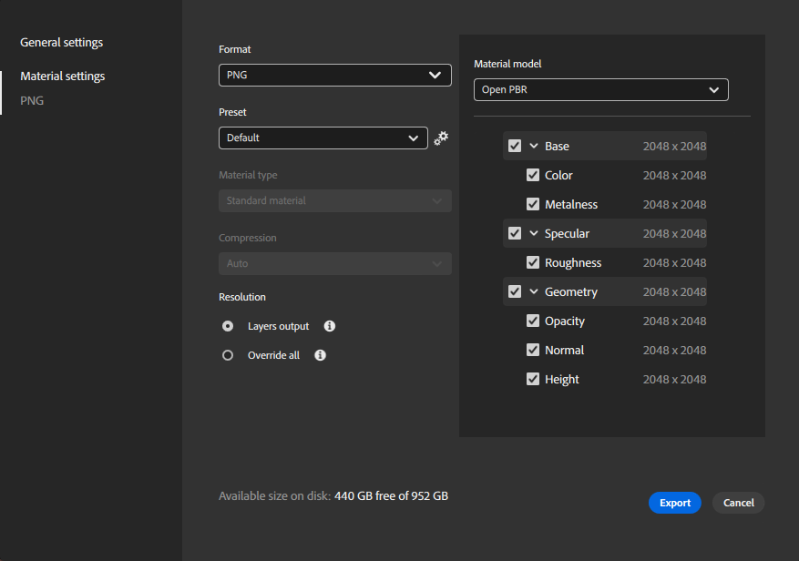

# 書き出し

**[ファイル]メニュー**&#x200B;の[**書き出し形式**]を選択するか、ショートカット **Ctrl + E**&#x200B;を使用して、デザイン素材を書き出すことができます。これにより、[書き出しウィンドウ](../../getting-started/export/export-window/export-window.md)が開き、書き出しをカスタマイズできます。

>[!NOTE]
>
> **書き出しウィンドウ**&#x200B;で「マテリアルモデル」オプションを変更すると、書き出されるファイル名が選択したマテリアルモデルと一致するように変更されます。

Samplerは、アセットの主要なファイル形式をサポートしています。

* マテリアルは、**SBS**&#x200B;または&#x200B;**SBSAR**&#x200B;ファイルとしてエクスポートできます。
* または、次のファイル形式でチャンネルごとのビットマップテクスチャを書き出すこともできます。
  * **EXR**
  * **JPEG**
  * **PNG**
  * **TARGA**
  * **TIFF**
  * **USDA**
  * **USD**
  * **USDZ**

書き出しプリセットの書き出しと管理の詳細：

* [書き出しウィンドウ](../../getting-started/export/export-window/export-window.md)
* [デフォルトのプリセット](../../getting-started/export/default-presets/default-presets.md)
* [カスタムプリセットの管理](https://helpx.adobe.com/substance-3d/unlisted/documentation/sadoc/creating-and-importing-custom-presets-188976295.html)
* [プリセットの管理](managing-presets.md)
