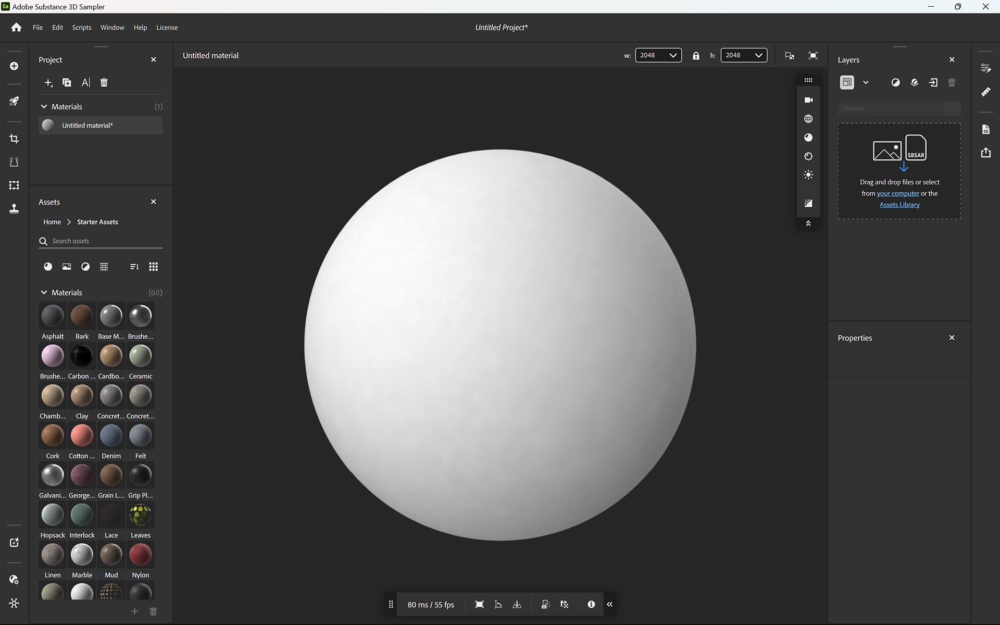
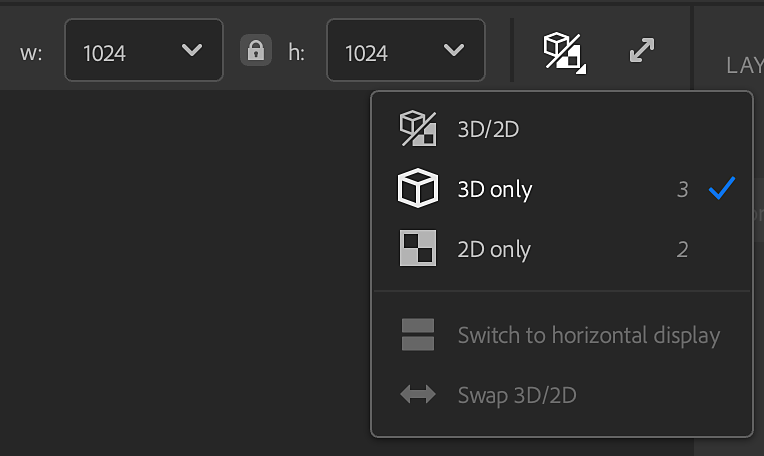
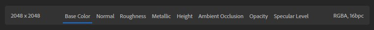

# 2Dおよび3D ビューポート

**ビューポート**&#x200B;に現在のアセットが表示されます。 **V****iewport**&#x200B;の上部に、アセットの名前と、**ビューポート**の外観を変えるためのオプションが表示されます。 これらのオプションを使用して、次の操作を行います。

* アセットの幅とHeightをピクセル単位で変更します。
* <b>2D ビュー</b>か<b>3Dビュー</b>を表示するか、<b>2D </b>と<b>3Dビュー</b>の両方を一緒に表示します。
* <b>ビューの分割</b>を水平表示に切り替えます。
* <b>3Dビューと2Dビューを入れ替えます</b>。
* 標準モードとフルスクリーンビューポートを切り替えます。

## 3D ビュー

<b>3D ビューポート</b>には、<b>ビューポート</b>でのアセットの表示方法を変更できる2つのツールバーがあります。 既定では、これらのツールバーは、<b>3D ビューポート</b>の右上隅と中央下に表示されます。

>[!NOTE]
>
> <b>3D ビューポート</b>ツールバーは再配置できます：
> 
> * ツールバーを移動するには、ツールバーの上部または左側にあるハンドルをドラッグします。
> * ツールバーの上部または左側にあるハンドルをダブルクリックすると、水平方向と垂直方向のレイアウトを切り替えることができます。
> * ツールバーの下部または右側にある二重山形をクリックして、ツールバーを最小化します。

<b>3D ビューポート </b>の右上にあるツールバーには、ビューポートの外観に焦点を合わせたコントロールがあります。

* <b>表示</b>: 視野や投影モードなどのカメラ設定を変更します。 さらに、グリッドと背景の色を変更します。
* <b>メッシュ</b>：別のメッシュを選択して環境光の素材を表示するか、マテリアルの素材のニュアンスを確認してください。
* <b>マテリアル</b>: メッシュ上のテクスチャの位置とタイリングを変更します。
* <b>ディスプレイスメント</b>:ディスプレイスメントの画質と強さを調整します。
* <b>ライト</b>:環境光を選択して調整します。シャドウやグリッドをオンにすることもできます。
* <b>パストレースの切り替え</b>:パストレースは、フォトリアルな結果を提供し、アセットの外観を改善するレンダリング技法です。 ただし、パストレーシングは計算に時間がかかる場合があります。必要に応じてパストレーシングをオンまたはオフにすることができます。

>[!NOTE]
>
> シャドウをオンにして、ビューポートのビジュアルを向上させます。 サンプラーのパフォーマンスを向上させるには、シャドウをオフにします。

<b>3D ビューポート</b>の下部中央にあるツールバーには、次の情報とコントロールがあります：

* <b>フレーム時間/FPS</b>：これらの値は、マテリアルのパフォーマンスを示します。
* <b>フレームオブジェクト</b>: カメラをメッシュの中央に配置します。
* <b>軸の変更</b>：使用する軸を変更します。 これは、読み込まれたメッシュに関する問題を修正するのに役立ちます。
* <b>配置</b>:グリッドに対するメッシュの配置方法を変更します。
* <b>スナップショットのコピー</b>：現在の<b>3D ビューポート</b>のイメージをクリップボードにすばやくコピーします。
* <b>スナップショットを保存</b>: <b>3D ビューポート</b>のスナップショットをイメージファイルに保存します。
* <b>3D ビューコントロール</b>: 3D ビューポートのカメラコントロールのクイックリファレンスを表示します。

## カメラを動かす

ビューポートはカメラを使用して3Dビューをレンダリングします。 カメラを動かして視点を変えたり、様々な角度から作品を見たりすることができます。

| ショートカット | 動き | 説明 |
| --- | --- | --- |
| クリックしながらドラッグ | 軌道周回 | カメラを回転させます。 カメラをロールできません。 |
| 右クリックしてドラッグ | ドリー | カメラを前後に動かします。 |
| 中マウスボタンをクリックしてドラッグ | パン | カメラを上下左右に動かします。 |

<b>2D ビュー</b>は2次元であるため、オービットオプションがありません。 右クリック+ Altキーを押しながらドラッグするとズームインおよびズームアウトし、中クリック+ Altキーを押しながらドラッグするとパンします。

<b>3Dビュー</b>と<b>2D ビュー</b>の両方で、<b>F</b>を使用して素材に注目します。 この機能は、3Dアセットや2D空間が見えなくなった場合に便利です。

## 2D ビュー

既定では、<b>3Dビュー</b>のみが表示されますが、<b>2D ビュー</b>には、一部のフィルターに関する有用な情報やコントロールが多く含まれています。

<b>2D ビュー</b>を開くには、ビューポートの右上にある<b>選択範囲を表示ボタン</b>を使用します。 ショートカット <b>2</b>を使用して、<b>2D ビュー</b>にすばやく切り替えることもできます。

<b>2D ビュー </b>を開くと、次の新しいオプションが表示されます。

* **2D ビュー**&#x200B;の右上隅にあるドロップダウンを使用して、表示に使用できるチャンネルのソースを変更します。

  * レイヤー入力：選択したレイヤーに入力されているチャンネルが表示されます
  * レイヤー出力には、選択したレイヤーが出力するチャンネルが表示されます
  * マテリアル出力は、上位レイヤーから出力されるチャンネルを示すもので、レイヤーの選択の影響を受けません。
* **2D ビュー**&#x200B;の下部では、次の操作を実行できます。

  * 選択したチャンネルの解像度を確認します。
  * 2D ビューで表示するチャンネルを選択します。
  * 選択したマテリアルチャンネルのカラーチャンネルとビット深度を確認します。

  
