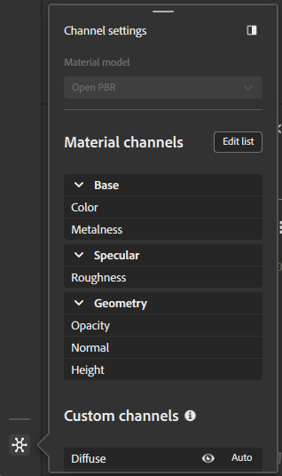
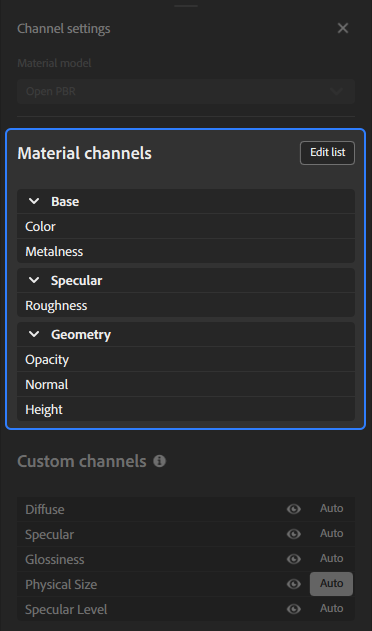
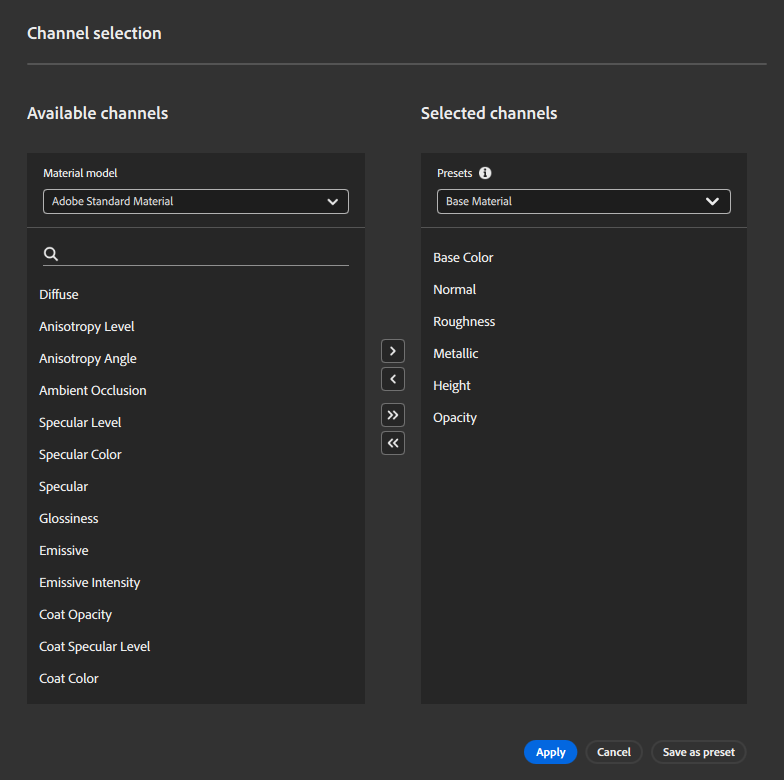

# チャンネル設定パネル

<table>
<tr style="border: 0;">
<td style="border: 0; width: 30%" valign="top">

**チャンネル設定**&#x200B;パネルは、現在のマテリアルで計算されたチャンネルのリストを制御します。 チャンネルの表示/非表示の管理、マテリアルへのチャンネルの追加/削除、使用中のマテリアルモデルの変更を行うことができます。

</td>
<td style="border: 0;" valign="top">

</td>
</tr>
</table>

## マテリアルモデル

このドロップダウンを使用して、マテリアルのレンダリングに使用するシェーダーフレームワークを選択します。 **チャンネル設定パネル**&#x200B;のオプションは、選択したマテリアルモデルに基づいて変わります。

マテリアルモデルを変更すると、新しいモデルのレイヤースタックを再計算し、別のチャンネルを使用できるようになります。 Samplerでは、変換時のデータ損失を最小限に抑えようとしています。ただし、新しいマテリアルモデルでは、この変更によって外観に微妙な違いが生じる可能性があります。

>[!NOTE]
>
> Adobe Standard Material(ASM)からOpenPBRへの変更は可能ですが、現在OpenPBRからASMへの変更は可能ではありません。

## マテリアルチャンネル

<table>
<tr style="border: 0;">
<td style="border: 0; width: 30%" valign="top">

このセクションには、ワークフローに基づいてデフォルトで計算されるチャンネルのリストが表示されます。

**[リストの編集]ボタン**&#x200B;を使用して、**チャンネルの選択範囲**&#x200B;を開き、マテリアルに対して計算するチャンネルを変更できます。

</td>
<td style="border: 0;" valign="top">

{width="200px"}

</td>
</tr>
</table>

>[!NOTE]
>
> Substance Sourceのマテリアルの中には、不透明度やambient occlusionチャンネルなどを出力しないものがあります。 不透明度チャンネルが「計算済み」とマークされていても、Substanceファイルが出力しない場合は、Samplerによって生成されません。

### チャンネルの選択

チャンネル選択ウィンドウでは、マテリアルにチャンネルを追加または削除できます。

マテリアルにチャンネルを追加するには、利用可能なチャンネルを選択し、**>ボタン**&#x200B;を使用します。
マテリアルからチャンネルを削除するには、**選択したチャンネルの一覧**&#x200B;からチャンネルを選択し、**&lt;ボタン**&#x200B;を使用します。
**≫ボタン**&#x200B;を使用してマテリアルに利用可能なすべてのチャンネルを追加したり、**≪ボタン**&#x200B;を使用してマテリアルからすべてのチャンネルを削除したりできます。

プリセットを使用して、マテリアルのチャンネルのリストをすばやく選択することもできます。 デフォルトでは、Samplerにはいくつかのプリセットが含まれていますが、独自のプリセットを作成することもできます。

1. 目的のチャンネルをマテリアルに追加します。
1. **[プリセットとして保存]ボタン**&#x200B;を使用します。
1. プリセットに名前を付けます。

>[!NOTE]
>
>プリセットを保存しても、プリセットはマテリアルに適用されません。

## カスタムチャンネル

選択したワークフローに含まれていない追加のチャンネルをデフォルトで切り替えます。

<table>
<tr style="border: 0;">
<td style="border: 0; width: 30%" valign="top">

各カスタムチャンネルには、制御に使用できる次の2つのオプションがあります。

1. 2D ビューのチャンネルを表示または非表示にするには、「表示/非表示」トグルを使用します。
2. **自動ボタン**&#x200B;を使用して、チャンネルが自動的に計算されるかどうかを切り替えます。
   * このチェックボックスにチェックマークが付いている場合、スタック内でチャンネルの上にあるレイヤから要求されると、チャンネルが計算されます。
   * オフにすると、チャンネルは常に計算されます。

</td>
<td style="border: 0;" valign="top">

![チャンネル設定パネルで、[カスタムチャンネル]セクションが強調表示されています。](../../assets/6.0_ChannelSettingsPanel_CustomChannels.png){width="200px"}

</td>
</tr>
</table>

