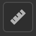

# 物理サイズパネル

<table>
<tr style="border: 0;">
<td width="41.60%" style="border: 0;" valign="top">

</td>
<td width="58.30%" style="border: 0;" valign="top">

**物理サイズパネル**&#x200B;を使用して、スキャンしたサンプルおよび画像の実際の物理サイズを構成します。

</td>
</tr>
</table>

スキャンしたサンプルと画像の実際の物理サイズをデジタルコンテキストで一致させることで、アプリケーション間で物理的に正確なビジュアルを実現します。\
次のツールとパラメータを使用すると、マテリアルの物理サイズを定義し、オブジェクトにマテリアルを適用するときに正確でリアルなビジュアルを作成できます。

## 物理サイズを設定

>[!NOTE]
>
> 素材の物理サイズを設定するには、画像の読み込みレイヤーが必要です。

サンプル/画像の物理サイズを計算するには、**物理サイズの設定**&#x200B;を有効にしてください。

### 入力画像サイズ

このセクションでは、サンプルのサイズを手動で設定できます。また、物理サイズを自動計算するためのツールも用意されています。

**参照レイヤー：**&#x200B;物理サイズの計算元の画像を参照します。\
**幅(X):**&#x200B;参照レイヤーの物理的な幅を設定\
**Height:**&#x200B;参照レイヤーの物理Heightを設定します\
**ツール：**

測定診断を使用すると、画像上の 2 点間の距離を測定できます（参考情報として使用する場合のみ）。

自動のものさしツールを使用すると、画像メタデータ (dpi) に基づいてサンプルの推定物理サイズを取得できます。 この方法は、スキャンしたサンプルでのみ正確です。

ものさしツールを使用すると、サンプルの2つのフィーチャー間の物理的な距離を指定して物理サイズを測定できます。 通常、サンプルの物理サイズを計算する場合は、この方法が最適です。

### 3D メッシュサーフェス

これらのツールを使用すると、マテリアルのサーフェスのアスペクトを設定できます。

**物理スケール：**&#x200B;物理スケールを有効または無効にします。 物理スケールは、3つの軸に沿ったメッシュの円周です。\
物理的な値を使用してマテリアルをスケールします。 幅(X)のHeight(Y)と深度(Z)を操作します。\
**テクスチャのタイリング:**&#x200B;マテリアルのタイリングを設定します

### 出力マテリアル

マテリアルの出力を実際の外観で視覚化できます。

**物理比の表示：**\
2Dビューポートの表示では、物理比が考慮されます。\
**Height尺度：**&#x200B;物理尺度に基づいて3Dビューポートから設定/計算されます。
