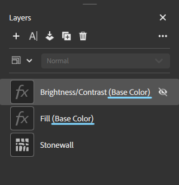

# 属性パネル

**プロパティパネル**&#x200B;には、**レイヤーパネル**&#x200B;で選択したレイヤーのパラメーターとプロパティが表示されます。 パラメーターの動作を確認する最も良い方法は、パラメーターを操作して、アセットに与える影響を確認することです。

**プロパティパネル**&#x200B;に表示されるパラメーターは、**レイヤーパネル**&#x200B;で選択した内容によって異なります。 場合によっては、1つのレイヤーに複数のカスタマイズ可能なプロパティのセットを含めることができます。例えば、スタックの一番下にないマテリアルレイヤーには、ブレンドプロパティがあります。 レイヤースタック内の各アイコンは、それぞれ異なるプロパティとパラメーターのセットです。 マテリアルプロパティとブレンドプロパティの両方を持つマテリアルレイヤーには、そのレイヤーに2つのアイコンがあります。

<table>
<tr style="border: 0;">
<td style="border: 0; width: 30%" valign="top">

</td>
<td style="border: 0;" valign="top">

**レイヤーパネル**&#x200B;のこの画像では、レイヤースタック内の各アイコンに、マテリアルの外観を制御するための異なるパラメーターセットが含まれています。 例えば、粘土レイヤーにはマテリアルアイコンとブレンドアイコンの両方があり、それぞれに個別のパラメータセットがあります。 ロールペイントレイヤーにはマテリアルアイコンとブレンドアイコンの両方がありますが、レイヤーの上にカーソルが置かれるため、表示と非表示を切り替えることもできます。

</td>
</tr>
</table>

## 適用先…

**プロパティパネル**&#x200B;の「**適用先**」セクションでは、現在のレイヤーが影響を与えるチャンネルを制御できます。 他のプロパティと同様に、チャンネル設定はレイヤーとブレンドのどちらが選択されているかによって異なります。

![プロパティチャンネルの[適用先…]セクションでは、現在のフィルターが影響を与えるチャンネルを制御できます。](../../assets/6.0_AppliedTo.png)

デフォルトでは、ほとんどのマテリアルとフィルターのすべてのチャンネルがオンに切り替わります。 明るさや自然な彩度などの一部のフィルターは、1つのチャンネルにのみ影響します。 フィルターが1つのチャンネルのみに適用される場合は、影響を受けるチャンネルがレイヤー名の横に表示されます。

