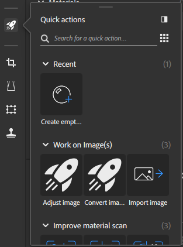
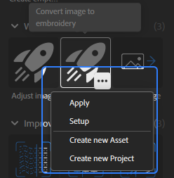

# クイックアクションパネル

[クイックアクション](../../features-and-workflows/quick-actions.md)は、数回のクリックで強力なアクションを実行できる機能とワークフローのコレクションです。 クイックアクションを使用して、マテリアルやプロジェクトを作成したり、既存のスタックに必要なレイヤーを追加したりします。

クイックアクションパネルで、クイックアクションの種類に応じてクイックアクションをクリックしてスタックに追加するか、新しいアセットを作成します。 クイックアクションは、次のカテゴリに分類されます。

* **最近使用したファイル** ：最近使用したクイックアクションにアクセスします。
* **画像で作業**：画像を読み込み、変換、調整します。
* **マテリアルスキャンを向上**:スキャンしたマテリアルを整列、調整、または並べて表示して、より良い結果を得ることができます。
* **画像からマテリアルを作成する**：必要なレイヤーをレイヤースタックに追加して、1つまたは複数の画像をマテリアルに変換します。
* **ゼロからマテリアルを作成する**：開始レイヤーを使用して新しいマテリアルアセットを作成します。

クイックアクションにカーソルを合わせると表示されるオプションボタンを使用して、次の操作を行うことができます。

* クイック操作をレイヤースタックに&#x200B;**適用**&#x200B;します。
* ダイアログを使ってクイックアクションを&#x200B;**設定**&#x200B;します。
* 選択したクイックアクションを使って&#x200B;**新しいアセットを作成**
* 選択したクイックアクションを使って&#x200B;**新しいプロジェクトを作成**

