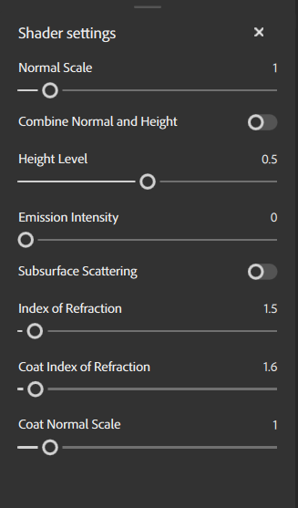

# シェーダー設定パネル

<b>シェーダー設定パネル</b>では、メッシュ上のアセットが3D ビューポートでどのようにシェーダーによってレンダリングされるかを設定できます。

## マテリアルパラメーター

マテリアルパラメーターを使用すると、現在のマテリアルがシェーダーによってどのようにレンダリングされるかを調整できます。

| パラメーター名 | 説明 |
| --- | --- |
| 法線スケール | 法線マップの強さまたは強さを調整します。 |
| 法線と高さを結合 | Heightと法線マップを1つのマップに結合するかどうかを切り替えます。 |
| 高さレベル | ディスプレイスメントのHeightの基本レベルを変更します。 |
| 放射強度 | emissiveマップの強さを調整します。 |
| サブサーフェススキャッタリング | 表面化散乱のオン/オフを切り替えます。 |
| 屈折率 | ライトがサーフェスを屈折させる角度を調整します。 |
| コートの屈折率 | 光がサーフェスコートから屈折する角度を調整します。 |
| コート法線スケール | 特にサーフェスコートの法線スケールを調整します。 |
