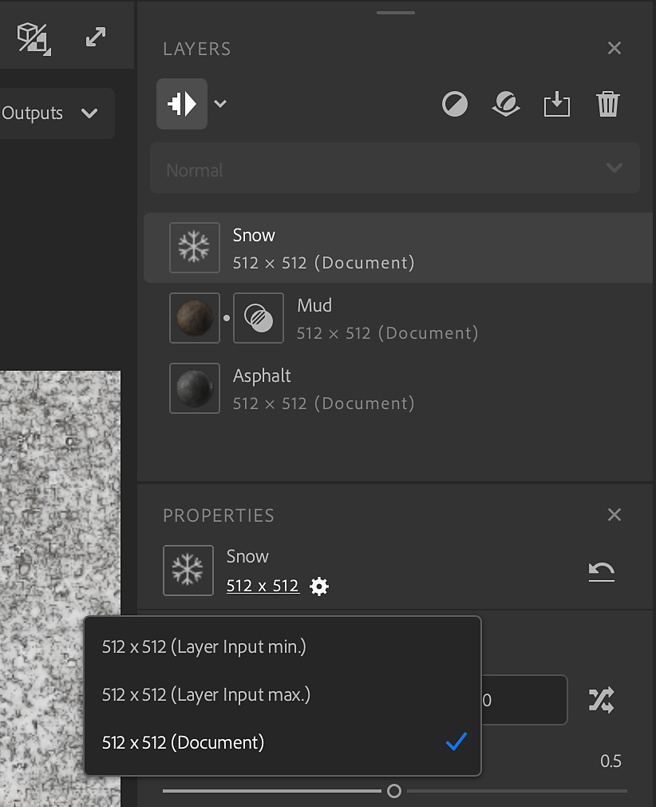
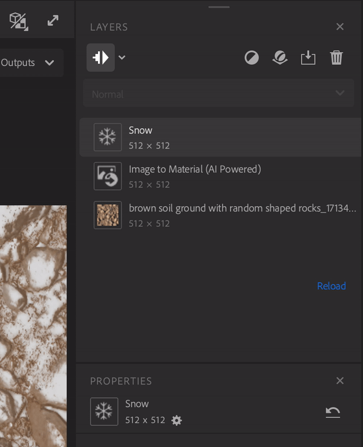

# レイヤー解像度

レイヤー解像度システムでは、レイヤースタック内の各レイヤーの解像度を完全に制御できます。 レイヤーには、ドキュメントサイズの解像度と、下のレイヤーの解像度のいずれかを指定できます。

解像度は各レイヤーに表示され、作品がマテリアルの解像度によってどのように影響を受けるかを簡単に視覚化できます。

これにより、材料の品質を高めることができますが、解像度を上げると、アセットの作業中のパフォーマンスに影響する可能性があることに注意してください。

ワンクリックで、作業用の解像度から高解像度に切り替えて、書き出し可能な最終的なマテリアルを視覚化できます。

