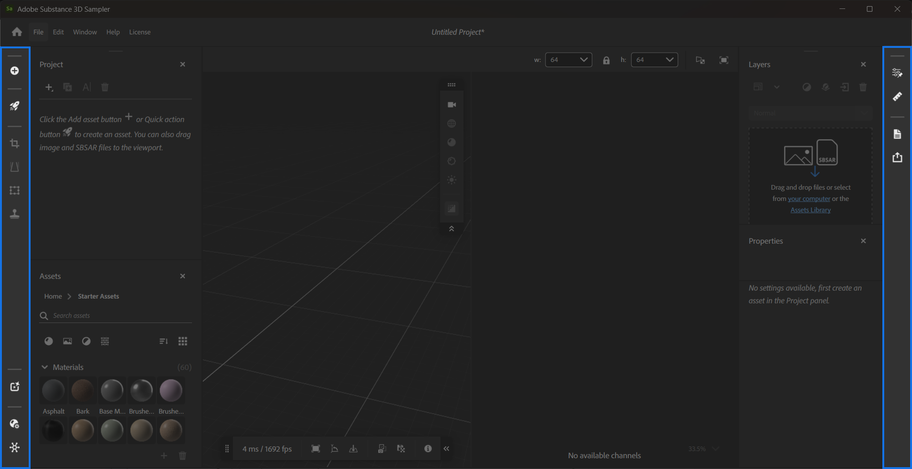

# サイドバー

Samplerには、**左サイドバー**&#x200B;と&#x200B;**右サイドバー**&#x200B;の2つのサイドバーがあります。

## 左サイドバー

**左側のサイドバー**&#x200B;では、次のことができます。

* **コンテンツの追加とインポート**：画像をインポートし、プロジェクトへの統合方法を選択します。
* **3Dアセットを参照**: Creative Cloudデスクトップ内のSubstance 3D Assetsから数千のマテリアルにアクセスします。
* **クイックアクション**&#x200B;にアクセス：特定の目標をすばやく達成するためのアクションのコレクションです。 [**クイックアクション&#x200B;**](../features-and-workflows/quick-actions.md)**の詳細情報。**
* レイヤースタックにすばやくフィルターを追加します。
  * **切り抜き：** **2D ビュー**&#x200B;のハンドルを使用して画像やマテリアルを切り抜きます。
  * **遠近法の変形:** **2D ビューのハンドルで遠近法エラーを修正してください。**
  * **変形:** **2D ビュー内のハンドルを使用して、画像やマテリアルのサイズを変更します。**
  * シームやその他の問題を解決するための&#x200B;**クローンスタンプ：**&#x200B;ペイント領域(**2D ビュー**)。
* 次のパネルを閉じたときに再度開く：
  * [**クイックアクションパネル**。](panels/quick-actions-panel.md)
  * [**プロジェクトパネル**。](panels/project-panel.md)
  * [**アセットパネル**。](panels/assets-panel.md)
  * [**チャネル設定パネル**。](panels/channel-settings-panel.md)

**左サイドバー**&#x200B;から利用できるフィルターの詳細については、「[ツールとウィジェット](tools-and-widgets/tools-and-widgets.md)」を参照してください。

## 右サイドバー

**右サイドバー**&#x200B;は、閉じたときに次のパネルを保持します：

* [**レイヤーパネル**。](panels/layers-panel.md)
* [**プロパティパネル**。](panels/properties-panel.md)
* [**表示されるパラーメーターパネル**。](panels/exposed-parameters-panel.md)
* [**物理サイズパネル**。](panels/physical-size-panel.md)
* [**メタデータパネル**。](panels/metadata-panel.md)
* [**書き出しパネル**](panels/share-panel.md)
