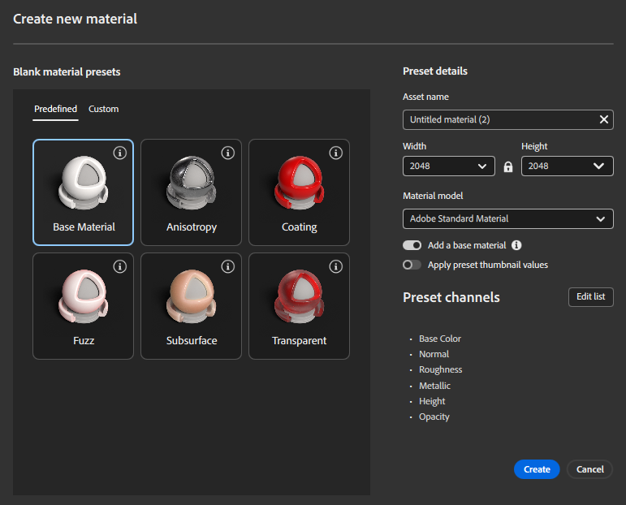

# マテリアル作成プリセット

マテリアル作成テンプレートには、高度な物理的ビヘイビアーを使用してマテリアルを構築するための定義済みの開始点が用意されています。 各テンプレートでは、特定の種類のサーフェスに必要なマテリアルモデル、有効なチャンネル、デフォルトのパラメータが設定されるので、結果を完全に制御しながら複雑なマテリアルをすばやく作成できます。 テンプレートは、新規マテリアルの作成時に使用でき、OpenPBRおよびASMマテリアルモデルの両方で使用できます。

>[!TIP]
> ファズ、地表、およびコーティングチャンネルを利用した高度なマテリアルの作成について詳しくは、[こちら](../../features-and-workflows/create-advanced-materials/advanced-materials.md)を参照してください。

## テンプレートからのマテリアルの作成

テンプレートを使用してマテリアルを作成するには：

新規マテリアルを作成ダイアログを開きます。 「事前定義」または「カスタム」タブからテンプレートを選択します。 マテリアル設定（名前、解像度、マテリアルモデル、チャンネル）を調整します。 「作成」をクリックして、設定済みのマテリアルの操作を開始します。

選択したテンプレートによって、有効になっているチャンネルやレイヤースタックでの設定方法など、マテリアルの初期構造が決まります。

## プリセットカテゴリ

### 定義済みテンプレート

事前定義されたテンプレートは、一般的な物理的なマテリアルの動作に対応するために設計された、すぐに使用できるマテリアル設定です。 また、各ユースケースに関するベストプラクティスと推奨チャネル設定をエンコードします。 使用可能な定義済みテンプレートは次のとおりです。

- ベースマテリアル一般的に使用されるチャンネルが有効になっている、物理的にベースの標準マテリアルです。 このテンプレートは、特殊なビヘイビアーを必要としない単純または一般的なマテリアルに使用します。

- 異方性方向に依存する反射をマテリアルに設定します。ブラシを使用した金属や、方向の細かいディテールを持つサーフェスに適しています。

- コーティングベースマテリアルの上に二次反射層を加え、クリアコートやワニスのような効果を可能にします。

- [ファズ]ビロードのような外観の布地、繊維、またはマテリアルに使用されるソフトな光散乱面の効果を有効にします。

- Subsurfaceワックス、プラスチック、有機面など、光がサーフェスの下を通過するマテリアルのサブサーフェス光輸送をアクティブにします。

- [透明]ガラスのような透明なマテリアルや薄い透明なガラスに適した光の透過マテリアルを構成します。

定義済みのプリセットを使用すると、必要なチャンネルとデフォルト値が自動的に設定されるため、手作業による設定や技術的な複雑さが軽減されます。

### カスタムプリセット

カスタムプリセットを使用すると、独自のマテリアル設定を再利用できます。 作成したマテリアルプリセットはすべてカスタムテンプレートとして保存でき、「カスタム」タブに表示されます。 これにより、共通の標準とチャンネル構成を使用して、プロジェクトやチーム間で一貫したマテリアルを作成できます。

## プリセットの詳細

プリセットの詳細パネルは、新しいマテリアルの作成に使用される設定を表示および制御します。

### アセット名

作成されるマテリアルアセットの名前を定義します。

### 解決策

マテリアルマップのデフォルトの解像度（幅とHeight）を制御します。 この解決策は、マテリアルの作成時に有効なすべてのチャンネルに適用されます。

### マテリアルモデル

マテリアルが使用するマテリアルモデルを指定します。

最新の標準化された物理ベースのワークフローのOpenPBR既存のパイプラインとの互換性を確保するためのASM

選択したテンプレートは、選択したマテリアルモデルに適用されます。

### ベースマテリアルを追加

有効にすると、Samplerは、選択したテンプレートと互換性のあるベースマテリアルを使用してベース塗りつぶしレイヤーを作成します。 これにより、即座に視覚的な結果が得られ、使用可能な開始点になります。 このベースマテリアルは、OpenPBRとASMの両方のマテリアルモデルに対応しています。

### プリセットサムネール値を適用

有効にすると、マテリアルはニュートラルな既定値ではなく、テンプレートのプレビューサムネイルの生成に使用される値で初期化されます。 これは、テンプレートの意図された動作を示し、構築を開始するための視覚的なベースを持つのに役立ちます。

### リストを編集

**[リストの編集]**&#x200B;をクリックして、素材を作成する前にチャンネルセットをカスタマイズします。 必要に応じてチャンネルを有効または無効にしたり、設定を新しいカスタムテンプレートとして保存したりできます。