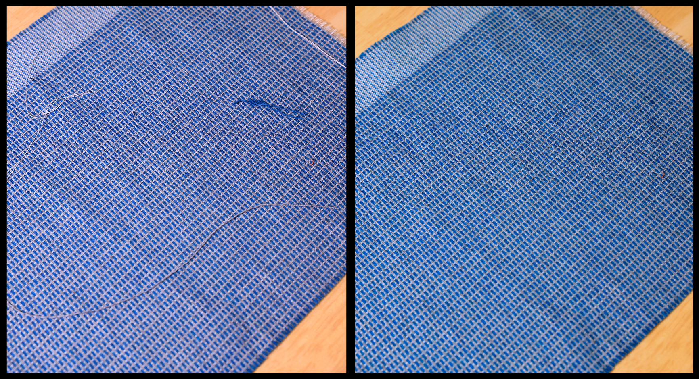
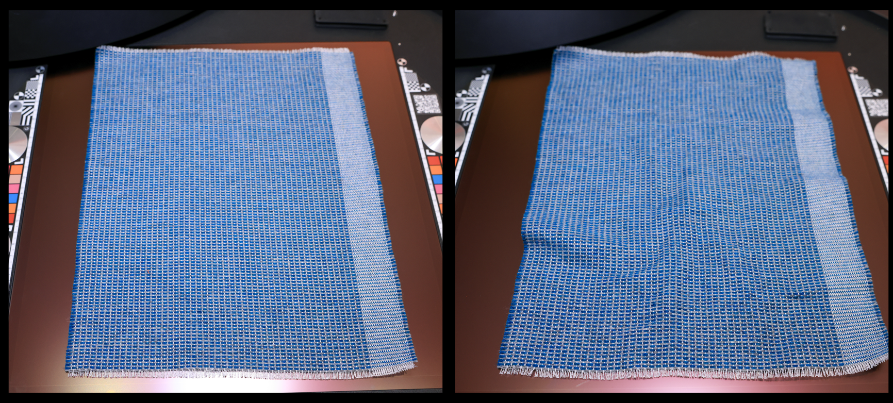
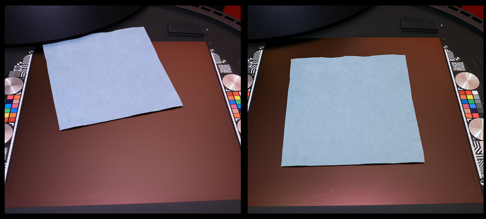

# スキャンのベストプラクティス

デジタル化されたマテリアルの画質は、スキャンボタンを押す前に決まります。 クリーンで平坦な場所に配置されたサンプルは、すぐに使用できるクリーンなマップを生成し、ラッシュキャプチャは、すべてのリンクル、Dustの斑点、浮遊ファイバをPBRチャンネルに直接搬送します。

経験則は簡単です。**スキャンの前に1分余分にマテリアルの準備を行うことで、後でクリーンアップを約10分間節約できます**。 生地にアイロンをかけたり、Dustを磨いたり、サンプルを揃えたりするのに費やした時間は、後でマテリアルの反りを取り除いたり、パーティクルにパッチを当てたり、繊維のゆるみを取り除いたりすることに費やすことのない時間です。

このページでは、最も大きな違いを生む2つの領域（**物理的なサンプルの準備**&#x200B;と、デバイスへの&#x200B;**正しい配置**）について説明します。

## 実際のサンプルの準備

キャプチャしたときにサンプルに表示されるすべての要素がマップにベイクされます。 数分の準備により、ソースの問題が削除され、その後編集作業が開始されます。

**サンプルの消去**

サンプルを置く前に素早くきれいにしてください。 サーフェス上のマークはマテリアルのディテールとして解釈され、すべてのチャンネルで再現されます。

**Dustと外部パーティクルを削除する**

Dust、髪、糸、その他の緩やかなパーティクルは、後処理の作業の最も一般的なソースの1つです。 ブラシをかけるか、圧縮空気を使って表面をクリアします。後で残ったパーティクルは手でペイントする必要があります。

**しわを取り除くためのアイロンの生地**

布やその他の柔軟なマテリアルの場合は、スキャンの前に必ずサンプルにアイロンをかけます。 しわや折り目によって、後で取り除くのが難しい誤ったHeightやシャドウ情報が生じ、マテリアルの整列性が損なわれます。

**滑らかな表面から汚れを取り除く**

スムーズで通気性の悪いマテリアルを使用して、汚れ、指紋、汚れを取り除きます。 これらは、base colorチャンネルとラフネスチャンネルにはっきりと表示されます。

**サンプルThicknessを理解する**

サンプルの太さに注意してください。 Thicknessを把握しておくと、正確に配置し、キャプチャを設定して、スキャン領域全体で表面のピントが合うようにします。

## サンプルを正しく配置する

適切に配置することで、マテリアルを平坦でシャープな中央に保ち、後で行う切り抜き、ゆがみの除去、アラインメントを減らすことができます。

**マテリアルをスキャン領域の中央に配置**

サンプルをスキャン領域の中央に配置します。 これは、フォーカスと照明が最も均一な場所であり、マテリアルが切り抜かれると、最も使用できるサーフェスになります。 そのため、一度に1つのサンプルをスキャンするのが常に理想的です。そのため、スキャン領域の中央に配置して、可能な限り最高の結果を得ることができます。

**可能な限りまっすぐにする**

角度ではなく、スキャン領域と垂直にサンプルを並べます。 Samplerでは、直線状のサンプルの方がずっと簡単に並べて表示でき、回転や切り抜きを減らすことができます。

**サンプルを横に並べる**

サンプルが走査面に対して完全に平らであることを確認します。 必要に応じて、HP Z Captisデバイスに付属のマグネットを使用して、フレキシブルまたはカールマテリアルを固定します。 平坦なサンプルでは、補正に時間がかかる湾曲や凹凸のある焦点を回避できます。

**サンプルを重ねない**

一度に複数のサンプルを配置する場合は、サンプルを接触させたり重ねたりしないでください。 エッジを重ねると境界があいまいになり、後で明確に分離して切り抜きにくくなります。

## Samplerの見返り

サンプルがクリーンで平坦で、中央に配置されている場合、Samplerに到着するマップはすでに本番環境に近い状態になっています。 マテリアルを修復する代わりに調整に時間を費やします。ワープを除去する時間が減り、Dustや繊維のクリーニングに費やす時間が減り、チャンネルの染みや皺を修正する時間が減ります。

マテリアルを読み込んだら、Samplerフィルター（イコライズ、自動タイリング、遠近法の切り抜き、タイリングなど）を使用して仕上げを行い、満足できる結果が得られたら書き出します。
