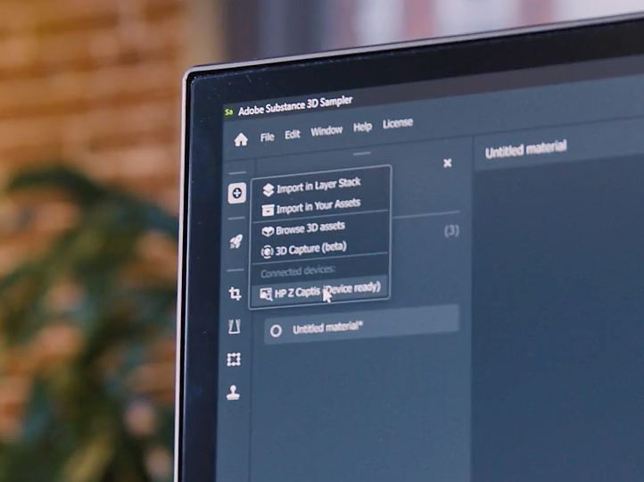
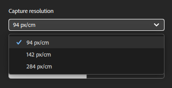
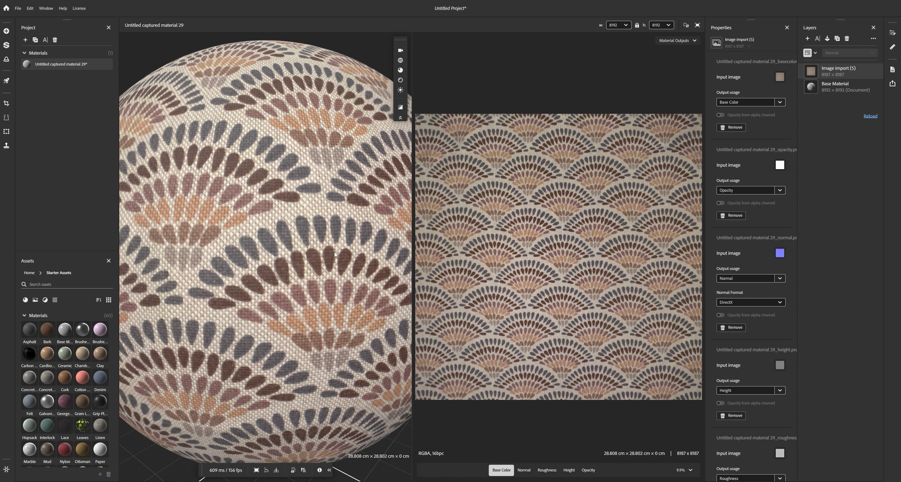

# Samplerを起動し、HP Z Captisをオンにします

Samplerが起動し、HP Z Captisデバイスがコンピューターに接続されたら、左側のバーのCaptis/coneアイコンをクリックします。

HP Z CaptisがUIに表示されない場合は、FAQを参照してください。

HP Z Captisをクリックすると、専用のウィンドウが開き、次の3つのオプションが表示されます。

1. <b>コンテンツの参照</b>:ファイルエクスプローラーが開き、HP Z Captisデバイスのローカルストレージを参照できます。
1. <b>スキャンを開始します</b>: HP Z Captisデバイスを初期化し、キャプチャフローを開始します。
1. <b>シャットダウン</b>:デバイスをシャットダウンし、ウィンドウを閉じます。

## HP Z Captisウィンドウを閉じる

HP Z Captisウィンドウを閉じると、いつでも<b>処理を続行</b>するか<b>中止</b>するかを確認するメッセージが表示されます。

続行を選択した場合、デバイスは現在のタスクをオフラインで続行し、現在のステップの最後で一時停止します。 後でSamplerに再接続して、キャプチャセッションの次の手順に進むことができます。

## プレビューの手順

SamplerはHP Z Captisデバイスのプレビューを初期化します。 ビューの初期化中に<b>ビューと対話</b>しないことをお勧めします。

この新しいアップデートには、自動と手動の2つのモードがあります。

### 一般設定

#### 自動モード

ワンクリックでキャプチャを起動できるようになりました。Samplerは次のことを行います。

* デフォルト名を定義し、
* バックライトを使用して、目標範囲(ROI)/クロップゾーンを自動的に定義します。
* 完全なROIに焦点を当てる
* 強度の設定をマテリアルに適合したものに変更します。

以前にキャプチャを行った場合、選択したマテリアルカテゴリ、出力、キャプチャ解像度は、以前のキャプチャと同じになります。

#### 手動モード

また、一部の設定を手動で定義することもできます。

*プロジェクト名*

キャプチャのプロジェクト名を定義し、取得する出力のタイプを定義できます。

*出力*

* デフォルトでは、マテリアルPBRチャンネル（ベースカラー、法線、Height、不透明度）のみが保存されます。\
  出力の種類をLDR（ローダイナミックレンジ）とHDR(ハイダイナミックレンジ)から選択できます。

*解像度のキャプチャ*

* 239 px/in - 94 px/cm（プレビュー：低品質、高速スキャン）
* px/in - 142 px/cm（デフォルト：高品質、ほとんどのワークフローで簡単に管理できます。30x30cmキャプチャの場合4kに相当します）
* 718px/in - 284 px/cm （フル解像度 – 30x30cmキャプチャの8 kに相当）

注意： Samplerに読み込まれるのはPBRチャンネルのみです。\
デフォルトのキャプチャが保存されるフォルダーは、環境設定で変更できます。

<b>マテリアルカテゴリ</b>

特定のマテリアルに合わせて微調整されたマップの生成のためにスキャンするマテリアルのタイプに設定します。\
デフォルトで選択されているカテゴリーは「Fabric」です。 これは、ラフチャンネルの結果を最適化するのに役立ちます。

スキャン対象に複数の種類の素材が含まれている場合は、最も大きい素材のカテゴリを選択してください。

<b>切り抜き</b>

切り抜きは自動または手動で行うことができます。

自動切り抜きは、バックライトを使用して素材の輪郭を定義し、その周りに目標範囲(ROI)を配置します。 複数のマテリアルサンプルを一度にデジタル化する場合や、マテリアルが非常に透明な場合には適用されません。
その場合、ROIは、プレビューで切り抜きウィジェットの角をドラッグするか、定義された解像度または物理サイズ度を設定することで定義できます。

<b>カメラ設定</b>

* 適用度：カメラの露光量を調整します。\
  「自動」をクリックすると、ROIの中心を使用して材料の最適な強度が定義されます。

* フォーカス：カメラのフォーカスを調整します。\
  「自動」をクリックすると、ROIをフルに活用して理想的なフォーカスを定義できます。
  この新しいフォーカスアルゴリズムでは、焦点が一点に集中する必要がなくなったため、デジタル化された素材に対してより均一な焦点を合わせることができ、高品質のスキャンが可能になり、タイル化が容易になります。

必要に応じて、両方を手動で設定できます。

<b>その他の設定</b>

その他の種類の設定<b>は、必要に応じて変更する必要があります</b>：色と配置の調整。

* カラーキャリブレーション

HP Z Captisの技術分野により、基本カラーマップの色を補正します。 \
これにより、最終的なマテリアルは、HP Z Captisトレイに追加したサンプルとまったく同じカラーになります。\
カラースウォッチのテクニカル領域は自動的に検出され、キャリブレーションに使用されます。 サンプルの両側の所定のスペースに配置する必要があります。

これは、Studioモードでのみ使用できます。 この色調整の前に必ずフォーカスを行ってください。

この調整は、<b>数か月ごとに</b>行う必要があります。 スキャンのたびに、またはデバイスを使用するたびに実行する必要はありません。

* 整列キャリブレーション

この調整<b>は、<b>デバイスを初めて設定するとき</b>に行う</b>必要があります。デバイスを物理的に移動するたびに、その後は2 ～ 3か月ごとに行います。 このプロセス<b>をキャプチャごとに</b>実行する<b>必要はありません</b>。

この位置合わせによる調整の前に、必ず焦点を合わせてください。

この整列を行うには、<b>テキストが印刷された紙のような、シャープでクリアな情報を含むものをキャプチャ領域の中央に配置します</b>。ドロワーを閉じて、整列ボタンをクリックしてください。 これを行うと、スキャンスペースの各側に技術的な領域があり、中央に配置された材料があり、必要に応じてHP Z Captisデバイスに付属の磁石で所定の位置に保持され、すべての場所に配置されていることを確認することができ、材料のスキャンを開始できます。

すべての設定が完了したら、<b>スキャンを開始</b>します。

## 手順のキャプチャ、処理、コピー

スキャンが開始されると、プレビューにはプロセス中に撮影された写真が表示されます。

加工部品は3つの部分に分割されます。

* <b>撮影</b>：必要なすべての写真を撮影しています

* <b>処理中</b>：写真を処理してPBRチャンネル（基本色、標準、Height、不透明度）を生成しています

* <b>コピー</b>: HP Z Captisデバイスからコンピューターに結果をコピーしています

メタデータ（Samplerメタデータパネルに表示されるのと同じメタデータ）をキャプチャおよび処理中に追加できます。

処理中に、タイルごとにタイルが作成された結果が表示されます。

## 概要の手順

この手順では、スキャンの結果を確認できます。 作成したすべてのチャンネルが表示されます（エクスプローラーモードでは、エクスプローラーリングにバックライトがないため、不透明度は作成されません）。

素材をSamplerに送り、プロジェクトに追加して処理を開始することもできます。
新しいキャプチャは、プロジェクトに追加せずに直接開始することもできます。
いずれの場合も、スキャンしたマップはお使いのコンピューターの対応するフォルダー( C:\Users\username\Documents\Adobe\Adobe Substance 3D Sampler\Captis\Material )にあります。

## マテリアル編集

HP Z Captisウィンドウを終了すると、チャンネル（ベースカラー、法線、Height、粗さ、不透明度が必要な場合）がレイヤーパネルにレイヤーとして追加されます。

Samplerフィルター（イコライズ、遠近法の切り抜き、タイリングなど）を使用して、素材の処理やクリーニングを行います。

完了したら、次の操作を実行できます。

* Samplerプロジェクトを保存：ファイル/別名で保存…(Ctrl + S)

* マテリアルを書き出す：ファイル/書き出し…(Ctrl + E)

