# バージョン2019.1

**Substance Alchemist 2019.1 「セサミ」**&#x200B;では、新しいプロジェクト管理を使用してアセットを共有できます。 レイヤースタックを完全に再構築して作業手順を改善しました。 その他のコントロールや情報がビューポートに追加されました。 新しいバージョンのdelighterにより、マテリアルの品質と精度が向上します。

リリース日： *4 November 2019*

>[!NOTE]
>
> **注意：**&#x200B;ベータ版のバージョン0.8.1以前で作成されたコンテンツは、バージョン2019.1と互換性がありません。 ただし、バージョン0.8.1を起動すると、何も失われず、このデータにアクセスできます。

## 主な機能

### 新しいようこそ画面

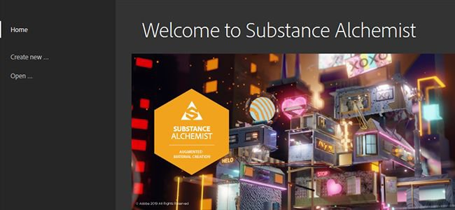

Substance Alchemistにようこそ画面が表示され、最新のプロジェクトをすばやく開始できるほか、新しいプロジェクトを作成することもできます。 ようこそ画面には、[Substanceアカデミー](https://academy.substance3d.com/)など、既存のプラットフォームへのリンクも表示されます。

### プロジェクト管理

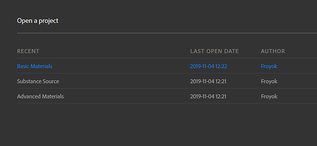

バージョン2019.1では、マテリアルのコレクションを収集できるプロジェクトの概念が導入されました。 プロジェクトを書き出して、他のコンピューターと共有することもできます。

プロジェクトの詳細については、[プロジェクト管理](../../getting-started/project-management.md)を参照してください。

### New Delighter

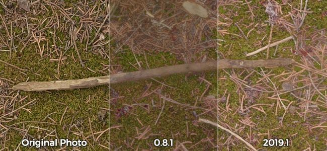

写真からシャドウを除去するために使用するハイライトを改善しました。 生成されたマテリアルの精度を向上させる必要がある、さまざまなサーフェスのディテールと元のカラーが保持されるようになりました。

### 新規レイヤースタック

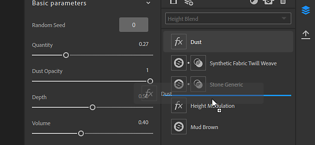

レイヤースタックは、可能性とアクションを広げるために、ゼロから再構築されました。 主な変更は次のとおりです。

* **マテリアルとマスクは、専用のアイコンから直接アクセスできるようになりました**\
  レイヤースタックにマテリアルを追加すると、新しいマスクアイコンが表示されます。 この2番目のアイコンをクリックすると、マテリアルのブレンドパラメータが表示されます。

  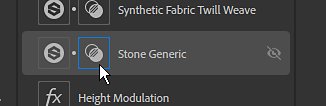
* **ブレンドモードは、ツールバーから直接変更できます**\
  これ以降、マテリアルレイヤーを選択すると、マスクをクリックしなくても、描画レイヤースタックをツールパネルから直接変更できるようになります。

  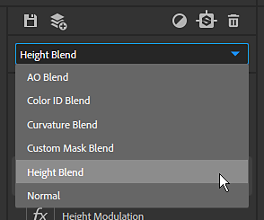
* **特定のスキャン入力にビットマップを割り当てる**\
  スキャンからマテリアルを作成するためにビットマップを読み込んだ場合は、ビットマップごとに適切な使用方法を割り当てることができます。

  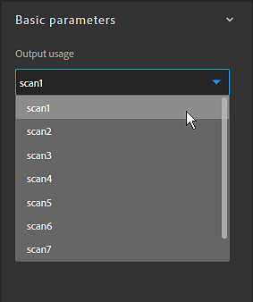

### ビューポートの向上

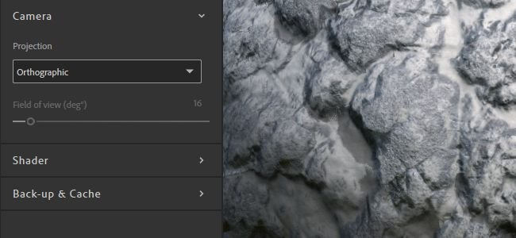

ビューポートにいくつかの新機能が追加され、操作性が向上しました。 これらの新しい設定は、[ビューアの設定パネル](https://helpx.adobe.com/substance-3d/unlisted/documentation/sadoc/viewer-settings-188973164.html)でアクセスできます。

* **カメラモード**\
  投影モードでは、遠近法モードと正投影モードを切り替えることができます。

  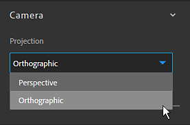
* **視野**\
  これで、ビューポートのカメラ視野(FOV)を変更できます。 この値を調整すると、マテリアルをリアルに視覚化するのに役立ちます。 視野は、遠近法投影モードでのみ制御できます。

  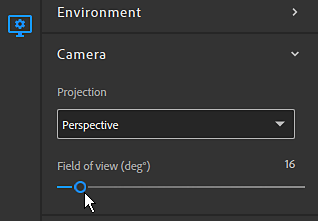
* **チャンネルごとの解像度とビット深度**\
  これで、2D ビューに各チャンネルのテクスチャの解像度とビット深度が表示されます。

  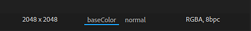

## リリースノート

### 2019.1.4ゴマ

*（2020年1月30日リリース）*

**追加：**

* [リソース]リソースフォルダをクリアするときに確認のプロンプトが表示されます

**修正済み：**

* [レイヤー]レイヤーを上下の2つ以上のレイヤーに移動
* [作成]十分なVRAM予算を確保し、パフォーマンスを向上させる

**既知の問題：**

* 大量のリソースを読み込むと、Substance Alchemistが低下することがあります
* 高解像度で、コンテンツに応じた塗りつぶしフィルターの処理が遅い
* 1つのマテリアルに複数の区切り記号を使用することはお勧めしません
* 古いNVIDIAドライバー（400.x未満）のクラッシュを喜ばせる
* スライダーに特定の値を入力するときは、昏睡やポイントを無視することができます
* macOSで「Heightに垂直」フィルターがクラッシュすることがある

### 2019.1.3ゴマ

*（2020年1月28日リリース）*

**追加：**

* [ワークフロー]複数のワークフローのサポート
* [ワークフロー] PBR 光沢度ワークフローのサポート
* [ワークフロー]新規チャンネル設定パネル
* [ワークフロー]プロジェクト作成時のワークフローの選択
* [チャンネル設定]特定のチャンネル計算をアクティブまたは非アクティブにします
* [チャンネル設定]現在のマテリアルで使用可能なカスタムチャンネルのリストを表示します
* [チャンネル設定]必要に応じてカスタムチャンネルを自動計算
* [チャンネル設定]カスタムチャンネルの計算を強制/ブロックする
* [レイヤー] Atlas Scatterおよびスプラッターフィルターのマテリアル入力プレースホルダーの新しいUI
* [レイヤー]フィルターの画像入力パラメーターは、レイヤーの下に置くことで確認できます
* [レイヤ]一部のレイヤが最新でない場合に通知を表示します
* [レイヤー]通知を使用して古いレイヤーの最新バージョンに更新できる
* [プロジェクト]プロジェクト作成時の新しいメタデータフィールド
* [インスピレーション]生成されたバリエーションはプロジェクトに固有です
* [2D ビュー]レイヤー入力、レイヤー出力、マテリアル出力を切り替える
* [ようこそ画面]プロジェクトの読み込み(.alch)オプションを追加
* [環境設定]キャッシュの場所と分析のプライバシー設定を行う新しい環境設定ウィンドウ
* [UI]新しいUIボタン
* 【パフォーマンス】並列化システムの全体的改善
* [パフォーマンス] マテリアルの計算数の最適化
* [エンジン] Substance engineの更新
* [フレームワーク] Qt 5.13へのアップグレード
* [MacOS] macOS Catalinaのサポートをグローバルに強化
* [コンテンツ]調整フィルタ – 法線の強度と反転のパラメータ

**修正済み：**

* [レイヤー]レイヤーを削除するときに画像入力パラメーターを設定解除する
* [レイヤー]コピーパッチレイヤーを追加する際のクラッシュの修正
* [レイヤー]他のマテリアルでレイヤースタックマテリアルをブレンドする際のクラッシュを修正
* [書き出し]書き出し用のチャンネル選択が優先されるようになりました
* [リソース]リソースパネルでナビゲーション中にクラッシュしない
* [Resources]破損したSubstanceファイルを読み込む際のクラッシュを修正
* [Resources]大きなフォルダーを読み込む際のクラッシュ数を減らす
* [サムネール]サムネールの計算でインターフェイスがフリーズしない
* [画像の読み込み]アプリケーション全体でサポートされる画像タイプの統一
* [Preset] SBSARからプリセットを作成するときに説明を保存します
* [インスピレーション]画像をドラッグ&amp;ドロップで修正
* [Application]終了時にクラッシュを修正する
* [Application] マテリアルを書き出すときに終了時にクラッシュを修正する
* [UI]修正と改善
* [UI]一時マテリアルの名前を「未保存のアセット」に変更する
* [コンテンツ]すべてのフィルタのグローバル更新とクリーニング

**既知の問題：**

* 大量のリソースを読み込むと、Substance Alchemistが低下することがあります
* 高解像度で、コンテンツに応じた塗りつぶしフィルターの処理が遅い
* 1つのマテリアルに複数の区切り記号を使用することはお勧めしません
* 古いNVIDIAドライバー（400.x未満）のクラッシュを喜ばせる
* スライダーに特定の値を入力するときは、昏睡やポイントを無視することができます
* macOSで「Heightに垂直」フィルターがクラッシュすることがある

### 2019.1.2セサミ

*（2019年12月11日公開）*

**追加：**

* [ワークフロー]複数のワークフローのサポート
* [ワークフロー] PBR 光沢度ワークフローのサポート
* [ワークフロー]新規チャンネル設定パネル
* [ワークフロー]プロジェクト作成時のワークフローの選択
* [チャンネル設定]特定のチャンネル計算をアクティブまたは非アクティブにします
* [チャンネル設定]現在のマテリアルで使用可能なカスタムチャンネルのリストを表示します
* [チャンネル設定]必要に応じてカスタムチャンネルを自動計算
* [チャンネル設定]カスタムチャンネルの計算を強制/ブロックする
* [レイヤー] Atlas Scatterおよびスプラッターフィルターのマテリアル入力プレースホルダーの新しいUI
* [レイヤー]フィルターの画像入力パラメーターは、レイヤーの下に置くことで確認できます
* [レイヤ]一部のレイヤが最新でない場合に通知を表示します
* [レイヤー]通知を使用して古いレイヤーの最新バージョンに更新できる
* [プロジェクト]プロジェクト作成時の新しいメタデータフィールド
* [インスピレーション]生成されたバリエーションはプロジェクトに固有です
* [2D ビュー]レイヤー入力、レイヤー出力、マテリアル出力を切り替える
* [ようこそ画面]プロジェクトの読み込み(.alch)オプションを追加
* [環境設定]キャッシュの場所と分析のプライバシー設定を行う新しい環境設定ウィンドウ
* [UI]新しいUIボタン
* 【パフォーマンス】並列化システムの全体的改善
* [パフォーマンス] マテリアルの計算数の最適化
* [エンジン] Substance engineの更新
* [フレームワーク] Qt 5.13へのアップグレード
* [MacOS] macOS Catalinaのサポートをグローバルに強化
* [コンテンツ]調整フィルタ – 法線の強度と反転のパラメータ

**修正済み：**

* [レイヤー]レイヤーを削除するときに画像入力パラメーターを設定解除する
* [レイヤー]コピーパッチレイヤーを追加する際のクラッシュの修正
* [レイヤー]他のマテリアルでレイヤースタックマテリアルをブレンドする際のクラッシュを修正
* [書き出し]書き出し用のチャンネル選択が優先されるようになりました
* [リソース]リソースパネルでナビゲーション中にクラッシュしない
* [Resources]破損したSubstanceファイルを読み込む際のクラッシュを修正
* [Resources]大きなフォルダーを読み込む際のクラッシュ数を減らす
* [サムネール]サムネールの計算でインターフェイスがフリーズしない
* [画像の読み込み]アプリケーション全体でサポートされる画像タイプの統一
* [Preset] SBSARからプリセットを作成するときに説明を保存します
* [インスピレーション]画像をドラッグ&amp;ドロップで修正
* [Application]終了時にクラッシュを修正する
* [Application] マテリアルを書き出すときに終了時にクラッシュを修正する
* [UI]修正と改善
* [UI]一時マテリアルの名前を「未保存のアセット」に変更する
* [コンテンツ]すべてのフィルタのグローバル更新とクリーニング

**既知の問題：**

* 大量のリソースを読み込むと、Substance Alchemistが低下することがあります
* 高解像度で、コンテンツに応じた塗りつぶしフィルターの処理が遅い
* 1つのマテリアルに複数の区切り記号を使用することはお勧めしません
* 古いNVIDIAドライバー（400.x未満）のクラッシュを喜ばせる
* スライダーに特定の値を入力するときは、昏睡やポイントを無視することができます
* macOSで「Heightに垂直」フィルターがクラッシュすることがある

### 2019.1.1セサミ

*（2019年11月26日リリース）*

**追加：**

* [ブレンド]新しい不透明度ブレンドモード
* [エンジン]新しいSubstance engineのバージョン

**修正済み：**

* [レイヤー]計算中のレイヤーを削除するときにクラッシュが発生する
* [レイヤー]一番下のレイヤーを削除するときにクラッシュが発生する
* [レイヤー] マテリアル名に特殊文字が含まれている場合にクラッシュが発生する
* [レイヤー]ウィジェットを使用するすべてのフィルターの計算を停止します
* [レイヤー] クローンパッチおよびコンテンツに応じた塗りつぶしフィルターを使用する際に、クラッシュを避ける
* [レイヤー]スプラッタ入力スロットでフィルターをドラッグ&amp;ドロップ中にクラッシュが発生する
* [Resources]ローカルフォルダーをリンクしているとき、またはSubstance Alchemistにリソースを読み込んでいるときのクラッシュを修正しました
* [Collection] マテリアル間で迅速に切り替える際のクラッシュを修正
* [UI]値がNULLであるか、ビューポートのタイリング、ディスプレイスメントスライダーで無効であるときに、クラッシュが発生する
* [インスピレーション] 「インスピレーション」タブへのアクセス中のクラッシュの修正
* [インスピレーション]保存されたばかりのレイヤーのマテリアルでインスピレーションを与えながら、クラッシュを修正
* [パフォーマンス]ヘビーSubstanceのマテリアルとフィルター(タイリング)の処理が高速になります
* [ヘルプ]書き出しログファイルの修正
* [コンテンツ]すべてのチャンネルでランダム化フィルターが動作します
* [コンテンツ]マルチアングルのワークフローでは、すべてのスキャンが考慮されます
* [コンテンツ] AO ブレンド補正ブレンド
* [コンテンツ] ブレンド補正ブレンド
* [コンテンツ]カラーID ブレンド補正ブレンド
* [コンテンツ]カスタムマスクブレンドの描画を修正
* [コンテンツ] ラフネスを編集するための補正フィルターを修正
* [コンテンツ]カスタム通常チャンネルのアップロード用ベースマテリアルフィルターの修正
* [コンテンツ]エンボスフィルターのカスタム読み込みパターンを修正

**既知の問題：**

* 1つのマテリアルに複数の区切り文字を使用することはお勧めしません
* 古いNVIDIAドライバー（400.x未満）でDelighterがクラッシュする
* スライダーに特定の値を入力するときは、昏睡やポイントを無視することができます
* 「通常からHeight」フィルターは、MacOSでクラッシュする可能性があります

### 2019.1セサミ

*（2019年11月4日リリース）*

**追加：**

* [プロジェクト]プロジェクトの作成
* [プロジェクト]プロジェクトデータを含む.alchファイル形式の概要
* [プロジェクト]コレクションとそのマテリアルを含む.alchプロジェクトを書き出す
* [プロジェクト] .alchプロジェクトを読み込む
* [プロジェクト]最近使用したプロジェクトを開く
* [ようこそ画面]起動時にようこそ画面が表示されます
* [ようこそ画面]ようこそ画面からプロジェクトを作成する
* [ようこそ画面]ようこそ画面にすべてのプロジェクトのリストにアクセスします
* [ようこそ画面]ドキュメントにアクセスするためのクイックリンク、ポップアップおよびライセンス管理について
* [ファイルメニュー]ファイルメニューの統合
* [ファイル] [ファイル]タブからプロジェクトコマンドにアクセスし、レイヤースタックを保存します
* [ファイルメニュー] 「編集」タブから「取り消し」コマンドとやり直しコマンドにアクセスできます
* [ファイルメニュー]前のヘルプメニューが[ヘルプ]タブの下の[ファイル]メニューに移動しました
* [レイヤ]レイヤースタックの新しいアーキテクチャ
* [レイヤー] レイヤースタックの新しいUI
* [レイヤー]ツールバーで描画モードを直接選択します
* [レイヤ]ブレンドパラメータとマテリアルパラメータに個別にアクセスする
* [レイヤー] レイヤースタックのスプラッターフィルターの専用入力に直接マテリアルを追加します
* [レイヤー]画像の読み込みレイヤーでスキャン順序を直接変更する
* [ビューポート] カメラ視野の制御
* (ビューポート)正投影モードと遠近法カメラの切り替え可能
* [ビューポート]各チャンネルの表示解像度とビット深度情報
* [Resources] ベースマテリアルはデフォルトで開かれています
* [キャッシュ]サムネールキャッシュフォルダーを見つける
* [キャッシュ]レンダーキャッシュフォルダを見つける
* [パネル] マテリアル設定パネルが一時的に非表示になる
* [ワークフロー] Specular/光沢度が一時的に無効になっています
* [MacOS] Catalina OSバージョンの公証
* [コンテンツ] Delighterフィルターの新しいバージョン
* [コンテンツ]新しい画像コンテンツに応じた塗りつぶしフィルター
* [コンテンツ]新しいマテリアルコンテンツに応じた塗りつぶしフィルター
* [コンテンツ] 変形フィルターには安全な変形オプションがあります

**修正済み：**

* 新しいUIおよびアーキテクチャリリースでは、作成に関連する以前のすべてのバグは現在無効です
* ツールヒントでトップバーのアイコンが非表示にならない(3D、2D、2D/3D)
* [コンテンツ]スプラッターフィルターは、完全な高さマップを含むアトラスを受け入れます
* [コンテンツ]画像に対するフィルターの変形(scan1、scan2、...)

**既知の問題：**

* 1つのマテリアルに複数の区切り文字を使用することはお勧めしません
* 古いNVIDIAドライバー（400.x未満）でDelighterがクラッシュする
* スライダーに特定の値を入力するときは、昏睡やポイントを無視することができます
* 「通常からHeight」フィルターは、MacOSでクラッシュする可能性があります

**追加：**

* [ブレンド]新しい不透明度ブレンドモード
* [エンジン]新しいSubstance engineのバージョン

**追加：**

* [ブレンド]新しい不透明度ブレンドモード
* [エンジン]新しいSubstance engineのバージョン

**追加：**

* [ワークフロー]複数のワークフローのサポート
