# バージョン2020.2(2.2)

**Substance Alchemist 2020.2 「Udon」**&#x200B;は、新しいAIを活用した画像からマテリアルプロセスを導入し、1つの画像入力を完全なPBRテンプレートに変形し、マテリアル作成マテリアルを改善しました。ワークフローや操作性が大幅に改善され、新しいフィルターなどの新しいコンテンツも追加されました。

リリース日： *2020年6月15日*

## 主な機能

### 画像からマテリアル（AI搭載）

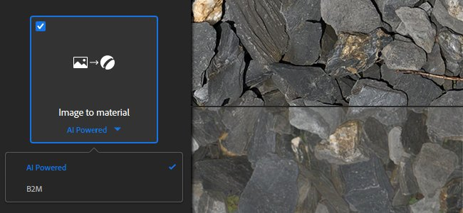

**マテリアルへの画像**&#x200B;テンプレートには、**AI利用**&#x200B;という名前の新しい設定があります。 この新しい設定により、1つの入力画像から高品質のPBRマテリアルを生成する際の結果が改善されます。

AIを活用した設定では、機械学習を使用してシェイプやオブジェクトを認識し、Heightや通常の情報を正確に生成します。 この設定には、シャドウとハイライトを除去する明るさフィルターも含まれています。 この新しい設定は、地面、小石、樹皮、石、および自然光で照らされたその他の外部ベースのサーフェスでトレーニングされたため、屋外のマテリアルに最適です。 今後のアップデートでは、サポート対象マテリアルの柔軟性と汎用性が向上します。 詳細については、[専用ドキュメントページ](../../filters/tools/image-to-material.md)を参照してください。

以下に、2つのアルゴリズムによって生成されたHeight情報とそのデフォルト値の比較を示します。

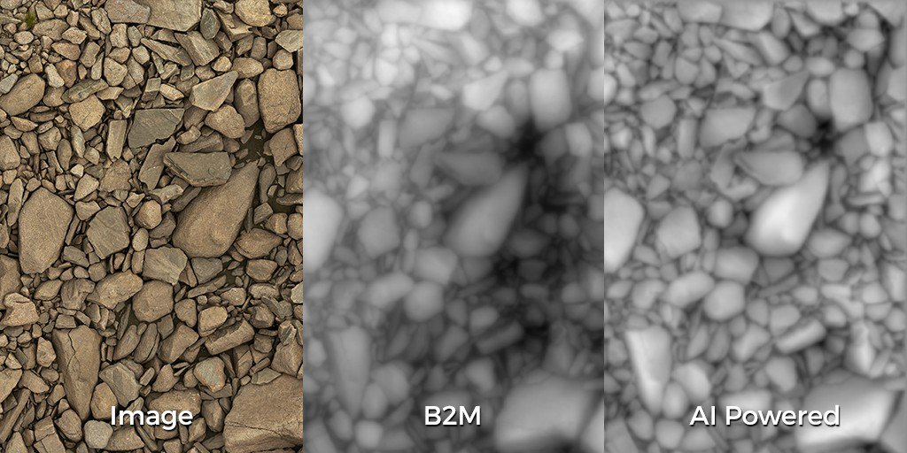{width="800px"}

>[!NOTE]
>
> AIを利用した設定には、特定のハードウェアが必要です。 Nvidia GPUを搭載したWindowsおよびLinuxでのみ使用できます。 詳細については、[技術要件](../../getting-started/system-requirements.md)を参照してください。

### 新しいテクスチャ読み込みテンプレート

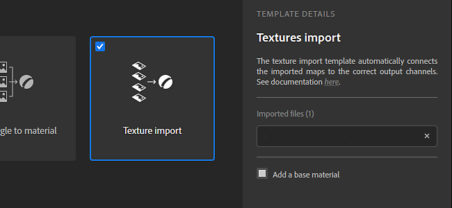

画像読み込みポップアップウィンドウの改善に、いくつかの点があります。 **テクスチャのインポート**&#x200B;という名前の新しい種類のプロセスもあります。

* **改善されたインターフェイス**\
  インターフェイスが更新され、使いやすさと学習が容易になりました。各オプションの詳細な説明も利用できます。
* **新しいテクスチャのインポートオプション**\
  **テクスチャの読み込み**&#x200B;という名前の新しいオプションを使用できるようになりました。このオプションを使用すると、画像のセットを、その名前に基づいて適切な出力チャンネルに直接読み込んで接続できます。 これにより、既存の画像グループからマテリアルを簡単に設定できます。 詳細については、[専用ドキュメントページ](../../features-and-workflows/texture-import.md)を参照してください。

### フィルターのマスク入力の新しい2Dペイント

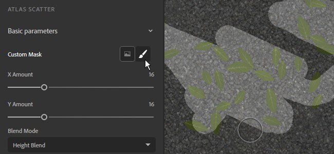

今回のバージョンでは、外部画像を読み込まずに、2D ビュー内で直接フィルターマスクのペイントと編集が可能になりました。 絵画は自動的にタイル化され、シームレスなマテリアルの作成を可能にします。

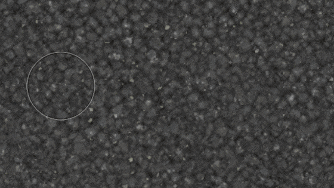{width="450px"}

* **2D ペイントモードに入ります**\
  2D ペイントモードを開始するには、フィルターのプロパティのマスク名の横にあるブラシアイコンをクリックします。

  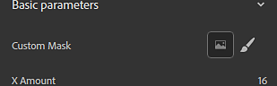
* **2D ペイントツールバー**\
  ペイントモード内では、2D ビューの上部に次の機能を持つ新しいツールバーが表示されます。

  * **ブラシの色**:マスクをペイントする際にブラシのグレースケール値を調整します。
  * **ブラシペンのサイズ**:マスクをペイントするためのブラシサイズを調整します。
  * **マスクをリセット**：現在のマスクを黒にクリアします。ペイント情報はすべて失われます。
  * **描画を停止**: 2D ペイントモードを終了します。

  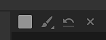
* **キーボードショートカット**\
  ペイントモードでは、以下のショートカットキーを使用してペイント処理を高速化できます。

  * **X**:ブラシの現在のグレースケール値を反転します。
  * **Ctrl +マウスホイール**:ブラシのサイズを変更します。
  * **[または]**:ブラシのサイズを変更します。

### 新しいアトラスとデカールの作成モードのショートカット

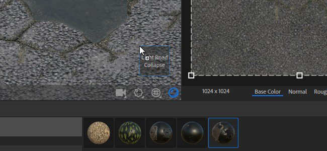

新しい種類のマテリアルを利用して、レイヤースタックでの設定を容易にするために、2つの新しい作成モードが追加されました。

* **デカールモード**\
  **Altキーを押しながらドラッグアンドドロップ**:コレクションからマテリアルをドラッグアンドドロップするときは、**Alt**&#x200B;を押したままドラッグアンドドロップすると、マテリアルがデカール投影モードで自動的に作成されます。
* **アトラスモード**\
  **Shiftキーを押しながらドラッグアンドドロップ**:コレクションからマテリアルをドラッグアンドドロップするときは、Shiftキーを押しながら操作すると、マテリアルがAtlas Scatterモードで自動的に作成されます。

### 新しい遠近法補正ツール

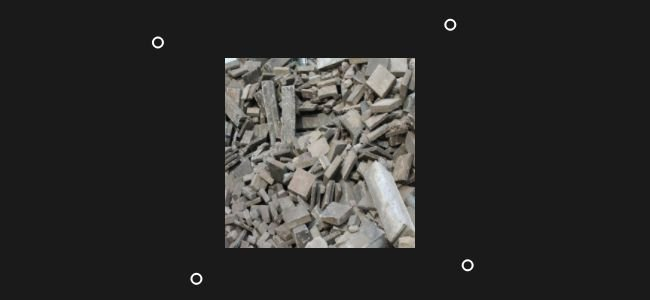

「**遠近法補正**」という名前の新しいツールがフィルターの一覧に追加され、画像の遠近法を補正できます。

* **遠近法の修正**\
  このフィルターを使用すると、スキャンと写真画像のデフォルトを補正して、マテリアル制作に適したものにすることができます。 フィルターには、画像の最初のコーナーを表す4つのコントロールポイントがあります。 ポイントを動かして、遠近法を調整/補正します。

  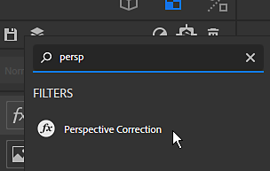

### カラーウィジェットの改善

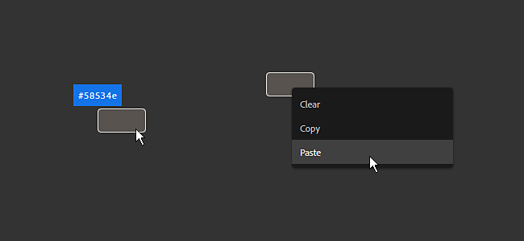

パラメーターパネルに表示されるカラーウィジェットに、さらに多くのコントロールが追加されました。

* **カラー値のツールヒント**\
  マウスをカラーウィジェットの上に置くと、現在のカラー値（16進数形式）を説明するツールヒントが表示されます。
* **右クリック操作**\
  カラーウィジェットを右クリックすると、次のアクションを含む新しいコンテキストメニューが表示されます。
  * **クリア**:カラーを黒に設定し、アルファ値をゼロに設定します。
  * **コピー**:ウィジェットの現在のカラー値をメモリにコピーします。
  * **貼り付け**:メモリ内の現在のカラー値をウィジェットに貼り付けます。

### 新規コンテンツ

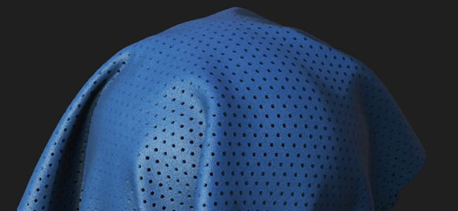

このバージョンには、新しいさまざまなコンテンツが数多く追加されています。

* **新しい既定のメッシュ**\
  ビューポートでマテリアルを表示できる新しいメッシュは3つあります。
  * 靴型
  * 男性のTシャツ
  * 女性のTシャツ
* **新しいフィルター**\
  このバージョンでは、次の5つの新しいフィルターを使用できます。
  * 亀裂
  * コケ
  * キルトステッチ
  * 下限タイル
  * PBR 検証
* **新しいブレンドモード**
* フィルターやその他のツールが、**チャンネルブレンドモードごと**&#x200B;という名前の新しい描画モードをサポートするようになりました。 このモードを有効にすると、プロパティパネルで各チャンネルのブレンド操作を微調整できます。
* **プリセットの書き出し**\
  このリリースには、新規および更新された書き出しプリセットが含まれています。
  * VStitcher
  * クロー
  * Unity HDRPテンプレートでのDetailMapサポート
