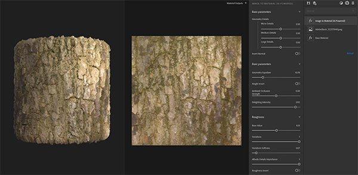
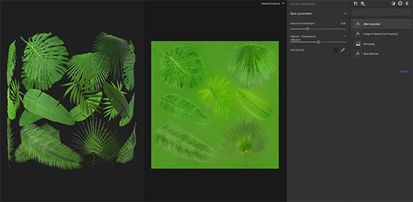
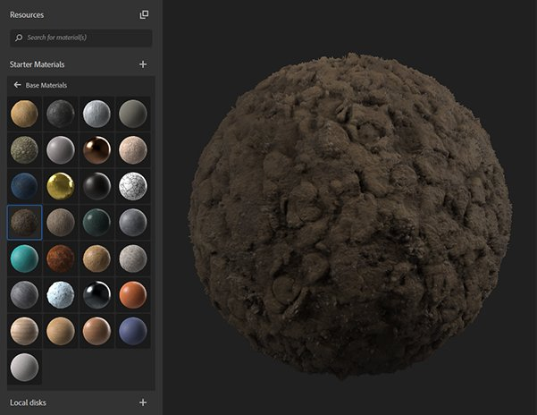
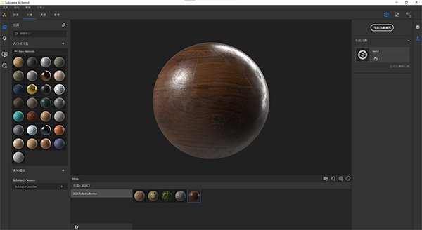

# バージョン2020.3(2.3)

**Substance Alchemist 2020.3 「Vermicelli」**&#x200B;では、新しいコンテンツや新しいワークフロー（1枚の画像からアトラスを作成するなど）が導入されています。 また、マテリアルのサムネールの画質も向上させ、インターフェイスを中国語にローカライズしました。

リリース日： *2020年10月26日*

## 主な機能

### 画像からマテリアル（AI搭載）

* 新しいパラメーター
  * 様々なレベル（小、中、大）のディテールを調整して、ジオメトリ（通常チャンネルおよびHeightチャンネル）を微調整します
  * ハイライトの強さを調整して、base colorのディテールが見えるようにします
  * 変位と柔らかさのパラメーターを使用して、より正確なラフネスチャンネルを作成できます
* Nvidia RTX 3000シリーズのサポート

### アトラス作成ワークフロー

2つの新しいフィルターが追加され、1つの画像からアトラスを作成する作業がSubstance Alchemist内で簡素化されました。

アトラスジェネレーター：フィルターは、base colorから不透明度チャンネルを自動的に生成します。 これにより、base color上にもカラー拡散が作成されます。 背景を統一した画像を使用することをお勧めします。

Atlas Splitter:フィルターを使用すると、アトラスの特定の要素を分離して、サイズを変更することができます。

### サムネイル

サムネールは、新しい環境マップ Studio\_06を使用したSubstance DesignerのPBR レンダリングノードを使用して生成されるようになりました。

サムネールがSubstanceアーカイブファイル(\*.sbsar)に埋め込まれている場合、Substance Alchemistはサムネールを読み取り、再生成しないようになりました。

サムネールの画質を変更して時間を節約するために、環境設定の新しいパラメーターを使用できます。 デフォルトでは、画質は「高」に設定されています。

### 中国語のローカライズ

Substance Alchemistは中国語にローカライズされました。 環境設定でインターフェイス言語を変更できます。

### 新規および更新されたコンテンツ

* **技術フィルター**

ワープ：マテリアルにワープを適用してパターンを破ったり、マテリアルをより鮮明にしたりできます。

サーフェスリリーフ:マテリアルにリリーフとバリエーションを加えます（Heightモジュレーションフィルターに代わります）

反転：任意のチャンネルを反転します

* **風化フィルター**

Scratches:マテリアルに傷を付けます。 木材や金属などに便利です。

指紋：金属や光沢のあるマテリアルに指紋を追加します。

廃棄された歯ぐき：地面に古い歯ぐきを散乱する

* **カラーフィルター**

カラー化：マテリアルの一部またはすべてを色合い化します。

カラーバリエーション：マテリアルのセグメント化の方法を選択できるようになりました。 base colorに加えて、Height、ambient occlusion、メタリック、ラフネスを使用できます。

カラーを置き換え： 2D ビューのカラーを選択して、新しいカラーを選択します。
