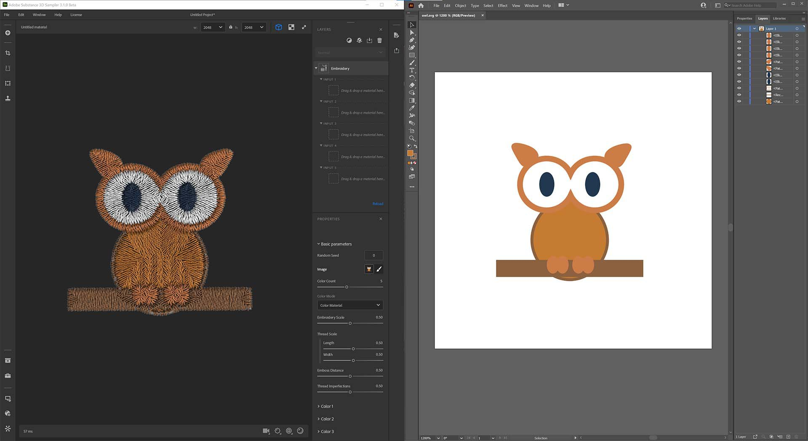

# バージョン3.1

Adobe Substance 3D Sampler 3.1では、新しいカラーピッカーが導入され、SVGファイルがサポートされています。また、Stager、Photoshop、Illustratorとの相互運用性が向上しています。

リリース日： *2021年9月28日*

## 主な機能

### カラーピッカー

このリリースでは、スポイトとスウォッチのサポートを含む新しい[カラーピッカー](../../interface/tools-and-widgets/color-picker.md)が追加されています。

カラーピッカーは、カラーを選択する必要がある場合に表示されます。 画面上の任意の場所に移動できます。

{width="250px"}

### SVGサポート

SamplerがSVGファイルをサポートするようになりました。 レイヤースタックやレイヤーの画像入力に直接、アセットに読み込むことができます。

{width="500px"}

### Illustrator で編集

新しい「編集イン」機能により、読み込まれた画像を更新する際の柔軟性が大幅に向上します。 SVGファイルを微調整する場合は、Illustratorでファイルを直接編集するだけです。 Samplerは、ビジュアルを新しいSVGで即座に更新します。

### 新しい切り抜きUX/UI

Samplerに、切り抜く領域を簡単に指定できる適切な切り抜きウィジェットが追加され、改良されました。 また、非正方形の画像を正方形のテクスチャに切り抜く場合も、伸縮された結果は生成されません。

{width="500px"}

### 法線の形式

環境設定を編集して、ワークフローに必要な[通常の形式](../../interface/preferences/normal-format.md)を設定します。 法線は、環境設定で選択した形式で読み込まれ、表示、書き出されます。

{width="250px"}

### SBSARでのマテリアルプロパティの書き出し

シェーダ設定のすべてのマテリアルパラメータ（法線スケール、Heightスケール、Heightレベルなど） はSBSARファイルに書き出され、Substance 3D Stagerで読み取られて、完全なマテリアルの一致が得られます。

{width="500px"}

## リリースノート

### 3.1.0ソコアルト

*（2021年9月28日リリース）*

**追加：**

* [カラーピッカー]新しいカラーピッカーUI
* [カラーピッカー]現在のカラーと以前のカラーを並べてプレビューします
* [カラーピッカー]カラーを16進数で入力
* [カラーピッカー]カラープレビュー付きの新しいスポイト
* [カラーピッカー]スポイトでSamplerの外側のカラーを選択できる
* [カラーピッカー] RGBまたはHSVカラースペースでカラーを微調整します
* [カラーピッカー]スウォッチの保存と管理
* [相互運用性] Image ImportレイヤーまたはImageパラメーターからIllustratorで画像を編集
* [相互運用性] Image ImportレイヤーまたはImageパラメーターからPhotoshopで画像を編集
* [Widget]新しい切り抜きウィジェット
* [Widget]切り抜きを検証するにはEnterキーを押します
* [ウィジェット]切り抜きウィジェットは、ウィジェットに合わせて画像サイズを読み取り、サイズ変更時に比率を維持します
* [UI]新しいグレースケールスライダーUI
* [アプリケーション]環境設定で標準形式の選択を追加
* [アプリケーション]画像読み込みレイヤーの標準形式は、環境設定で設定されたデフォルトの標準形式に従います
* [アプリケーション] 2Dビューでは、環境設定で設定された法線フォーマットに従って法線が表示されます
* [アプリケーション]環境設定で設定した標準形式で法線が書き出されます
* [書き出し] SBSおよびSBSARファイルの書き出しに通常の形式パラメーターを追加します
* [書き出し] SBSおよびSBSARファイルの書き出しにシェーダ設定を追加します
* [書き出し]書き出すSBSグラフのデフォルトの解像度を設定します
* [Compound Filters] 7zでSSAフィルタをパッケージ化します。
* [複合フィルタ]複合フィルタにカテゴリメタデータを追加する
* [複合フィルター]複合フィルターにはサムネールを埋め込むことができます
* [複合フィルター]コンテンツのファイルを取得ダイアログに複合フィルター拡張機能(.ssafilter)を追加しました
* [複合フィルター]アセットパネルに複合フィルター(.ssafilter)を読み込む
* [エンジン] substanceエンジンをv8.2.0にアップデートします。

**修正済み：**

* [アプリケーション]接続されたローカルフォルダがハングする可能性があります
* [アプリケーション]終了時にクラッシュする
* [アプリケーション] Samplerの2つのインスタンスを起動するとクラッシュする
* [コンテンツ]切り抜きフィルターにランダムなシードのツイークがあります
* [コンテンツ]一部のSubstanceマテリアルがアップグレードされない場合があります
* [書き出し]新しく追加したカスタムプリセットで書き出すとクラッシュする
* [書き出し]パッケージの推定サイズが書き出しポップアップに表示されない
* [書き出し] SBSおよびSBSARファイルの書き出し時のメモリリークを修正
* [複合フィルター]複合フィルターの入力が重複している可能性があります
* [複合フィルター]フィルターに一致しない参照がある場合にクラッシュする
* [複合フィルター]レイヤースタック内に複合フィルターを含むレイヤーを並べ替えるとクラッシュする
* [合成フィルタ]レンダリングがハングすることがある
* [イメージの読み込み]イメージを読み込むと、複数のレンダリングが開始される
* [レイヤー]取り消し/やり直し時にクラッシュする
* [レイヤー] ベースマテリアルを追加するとクラッシュする
* [レイヤー]無効な画像を環境光として使用するとクラッシュする
* [レイヤー]複数のグラフを含むフィルターを挿入する際に、重複する読み込みを修正
* [レイヤー]レイヤーの並べ替えが機能しない場合がある
* [プロジェクト]不完全なプロジェクトファイルを読み込むとクラッシュする
* [プロジェクト]破損したプロジェクトを開くとクラッシュする
* [プロジェクト]一部のアセットがプロジェクトから消える可能性があります
* [プロパティ]見つからないフィルターのプリセットを修正
* [UI]角度パラメータを設定できません
* [UI]アセットパネルでのメタデータ表示のフィルター
* [UI]カテゴリでグループ化するとフィルターが非表示になる
* [UI]アセットパネルでのスクロールの問題
* [UI]書き出しパネルにスクロールバーが表示される
* [UI]画像ピッカーで、一部の画像形式にサムネールが表示されない

**既知の問題：**

* [Realtime Engine 2021]演算が多いとアプリケーションがクラッシュする可能性がある
* [Realtime Engine 2021] AMD CPUとNvidia GPUの両方がインストールされているWindowsマシンで、Realtime Engine 2021がクラッシュする
* [カラーピッカー]解像度が異なる2台目のモニターでカラーを選択しても、機能しない場合がある
