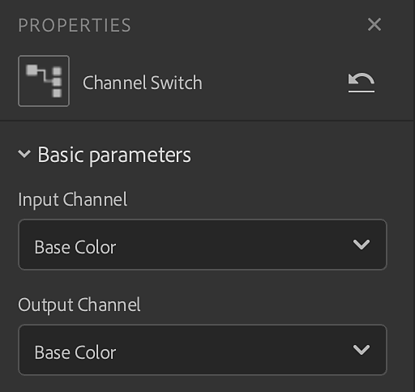
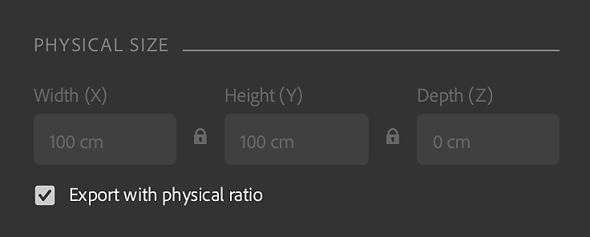

# バージョン3.2

**Substance 3D Sampler 3.2**&#x200B;は、マテリアルのデジタル化ワークフローをエンドツーエンドで導入します。このワークフローでは、マテリアル物理サイズ、布地の織布やチャンネルスイッチなどの新しいフィルター、およびカスタムのメタデータを作成する機能をキャプチャして処理します。

リリース日： 25 *2022年1月*

## 主な機能

### 物理サイズ

このリリースでは、マテリアルの物理サイズをキャプチャして処理する新しいマテリアルスキャニングワークフローが導入されています。

デジタルコンテキストでサンプル/画像の実際の[物理サイズ](../../features-and-workflows/end-to-end-physical-size-workflow.md)と一致させて、あらゆるソフトウェアで物理的に正確なマテリアルを作成します。

{width="400px"}

### 布織り

このリリースでは、新しいGeneratorが追加されています。 布地の織り方を使用すると、カスタムの織り方パターンを使用して布地の生地を作成およびデザインできます。

<table>
<tr style="border: 0;">
<td style="border: 0;" valign="top">

{width="390px"}

</td>
<td style="border: 0;" valign="top">

{width="400px"}

</td>
</tr>
</table>

### カスタムメタデータ

マテリアルにカスタムメタデータを追加します。 すべてのカスタムメタデータは、アプリケーション間でデジタルマテリアルを共有するためのより効率的なワークフローを保証するために、マテリアルファイル(SBSAR)に含まれます。

{width="264px"}

### チャンネル切り替え

チャンネル切り替えを使用して、マテリアルの出力マップのチャンネルを切り替えることができるようになりました。

{width="300px"}

### 書き出し

このリリースでは、新しい書き出し機能が追加されました。

* .sbsarファイル圧縮設定の設定

  {width="400px"}
* .sbs(ar)ファイルを書き出すときのグラフの種類の設定
* EXR、JPEG、PNG、TARGA、TIFFの物理比を維持

  {width="400px"}

## リリースノート

### 3.2.0焼き鳥

*（2022年1月25日リリース）*

**追加：**

* [物理サイズ]新規物理サイズパネル
* [物理サイズ] [マテリアル作成テンプレート]ウィンドウに物理サイズオプションを追加する
* [物理サイズ]物理サイズ計測ツールを追加
* [物理サイズ] 物理サイズ自動測定ツールを追加
* [物理サイズ] 物理サイズ診断ツールの追加
* [物理サイズ] 物理サイズのZ値の設定を許可します
* [物理サイズ] 2Dビューでのズームレベルを設定するドロップダウンウィジェット
* [物理サイズ]ズームレベルのドロップダウンに「縦横比を固定して表示」オプションが追加されました。
* [物理サイズ]ズームレベルのドロップダウンに「物理サイズに合わせる」オプションが追加されました
* [物理サイズ] 2Dビューで物理サイズを表示します
* [物理サイズ] 3Dビューポートに物理サイズを表示します
* [物理サイズ]画像の読み込みダイアログで、読み込まれたHeightマップがある場合に物理サイズ深度を表示する
* [物理サイズ]アセットのコンテキストメニューに物理サイズを表示
* [物理サイズ]環境設定で長さの単位を設定します
* [物理サイズ]物理比に従ってテクスチャをエクスポートします
* [メタデータ]ユーザーが作成したアセットにカスタムメタデータを追加する機能
* [書き出し]カスタムメタデータを.sbs(ar)ファイルに書き出す
* [書き出し]説明、カテゴリ、作成者、タグのメタデータを.sbs(ar)ファイルに書き出す
* [エクスポート] bs(ar)ファイルにエクスポートします
* [書き出し] .sbsarファイル圧縮設定を設定
* [書き出し]アセットのサムネールを.sbs(ar)ファイルに書き出します
* [書き出し] .sbs(ar)ファイルを書き出すときにグラフの種類を設定する
* [アプリケーション] Realtime Engine 2021が利用できなくなりました
* [アプリケーション]取り消し/やり直しで、タイリング(U、V)およびHeightスケールスライダーの変更がサポートされるようになりました
* [レンダリング]作成したアセットの保存時にディスクキャッシュを生成する
* [アセット]リソースパネルで複数のアセットタイプフィルターを有効にするには、Ctrlキーを押しながらクリックします。
* [UI]タイル(U、V)スライダーをロックする機能
* [UI]テキストフィールドに「コピー」、「カット」、「ペースト」、「すべてをコピー」、「すべてをカット」を含むコンテキストメニューを追加
* [UI]長さの単位（メートル、インチ、パーセク、...） ラベルおよびテキストフィールドのサポート
* [UI]数値の表示に使用する小数点以下の桁数を設定できます
* [UI]関連するすべての場所で単位ポップアップを使用する
* [ローカライゼーション]デフォルトの新しいアセット名がローカライズされました
* [コンテンツ]新しい布地織りジェネレータ
* [コンテンツ]新しいチャンネルスイッチフィルタ
* [コンテンツ]関連するすべてのフィルターが物理サイズを認識するようになりました
* [コンテンツ]木目仕上げの新しいアイコン
* [コンテンツ]すべてのフィルタがAdobe標準マテリアル(ASM)チャンネルと互換性を持つようになりました
* [コンテンツ]フィルターに「環境」バリエーションを追加できるようになりました

**修正済み：**

* [2Dビュー]削除してもチャネルはリストに残ります
* [アプリケーション]オペレーティングシステムのファイルエクスプローラーから読み込まれたアセットを複製できない
* [アプリケーション]終了時にクラッシュする
* [アプリケーション]アセットパネルで「スターターアセット」をクリックするとクラッシュすることがある
* [アプリケーション]マテリアルを削除するとクラッシュする
* [アプリケーション]環境変数「SUBSTANCE\_DISABLE\_SPECIFIC\_FEATURES」は、「0」または「」に設定してもアクティブです。
* [アプリケーション]複数のマテリアルを含むプロジェクトを保存中にフリーズする
* [アプリケーション]画像を読み込むとクラッシュする場合がある
* [アプリケーション]初回起動時に一部のスターターアセットが見つからない
* [書き出し]アセットを書き出すとクラッシュすることがある
* [レイヤー]レイヤーパネルが閉じているか表示されていない場合は、画像を読み込むことができません
* [レイヤ]言語を変更すると、現在のアセットが再計算されます
* [レイヤー]読み込まれた画像の使用を変更しても、使用するフィルターバリエーションが更新されない
* [レイヤー]下のレイヤーを微調整すると、画像からマテリアル(AI)が計算されないことがあります
* [レイヤー]不要な場合、画像からマテリアル(AI)が再計算されることがあります
* [レイヤー]ディスク上でカスタムフィルターが更新された場合、更新を提案しない
* [レイヤー]通常チャンネルのピクセル形式が間違っていることがあります
* [レイヤー]非表示でも一部のレイヤーが計算される
* [レイヤー]レイヤーの表示を切り替えると、2Dビューツールが壊れることがあります
* [レイヤー]画像からマテリアル(AI)を使用すると、UIがフリーズする
* [レイヤー]変形フィルターレイヤーの表示を切り替えると2D表示ツールが機能しなくなり、クラッシュする可能性があります
* [レイヤー]レイヤースタックからレイヤーを削除するときに、再計算が多すぎます
* [レイヤー]合成フィルターに特殊なカスタム入力/出力が含まれている場合、Samplerで計算されない
* [パフォーマンス]アセットパネルがなかなか開かない
* [パフォーマンス]レイヤースタックの不要な再計算を回避します
* [パフォーマンス]プロジェクトアセットの読み込みに時間がかかる
* [パフォーマンス]ディスク上のレンダーキャッシュは使用できません
* [パフォーマンス]レイヤーの切り替えが遅い
* [パフォーマンス]マテリアルやフィルタのツイークが遅い
* [プロジェクト]終了時にプロジェクトを保存すると、クラッシュする場合がある
* [レンダリング]イメージを削除すると、すべての出力が削除される場合がある
* [レンダリング]ビューポートに表示されているレンダリング時間が正しく表示されない
* [UI]必要に応じて、書き出しポップアップで垂直方向にスクロールできない
* [UI]書き出す対象がない場合、書き出しポップアップを開くことができる
* [UI]一部のポップアップで、コンテンツがオーバーフローしてもスクロールされない
* [UI]テキストフィールドをクリックしても、またはメニューを開いても、テキストフィールドが選択されない
* [UI]プロパティパネルの描画モード名が正しくない場合がある
* [UI]ファイルメニューの「保存」オプションがグレー表示になる場合がある
* [UI] 2つのマテリアルの名前を変更した後、テキストフィールドが消えない
* [UI]環境設定ポップアップで間違いが発生する

**既知の問題：**

* [カラーピッカー]解像度が異なる2台目のモニターでカラーを選択しても、機能しない場合がある
