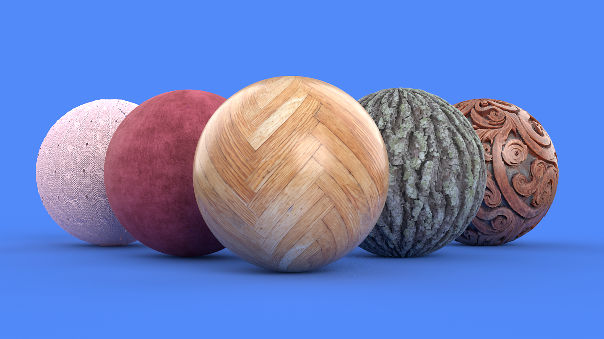
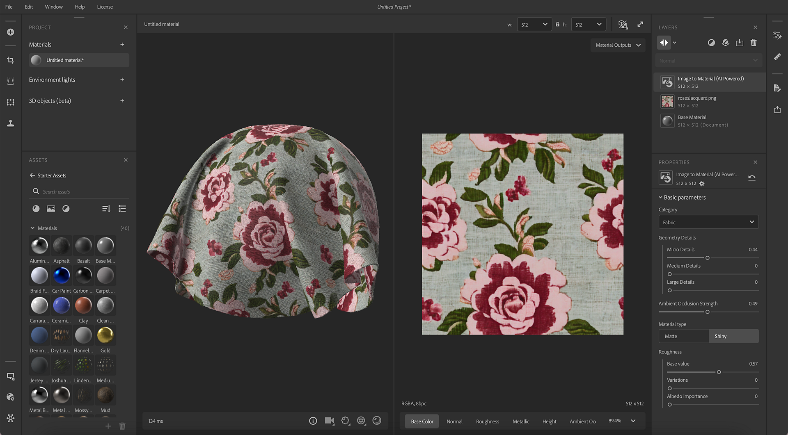
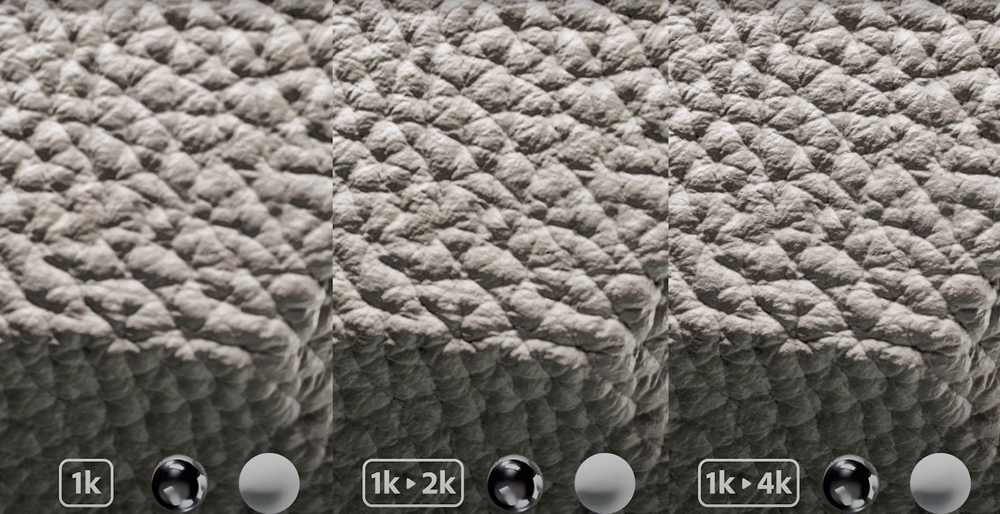
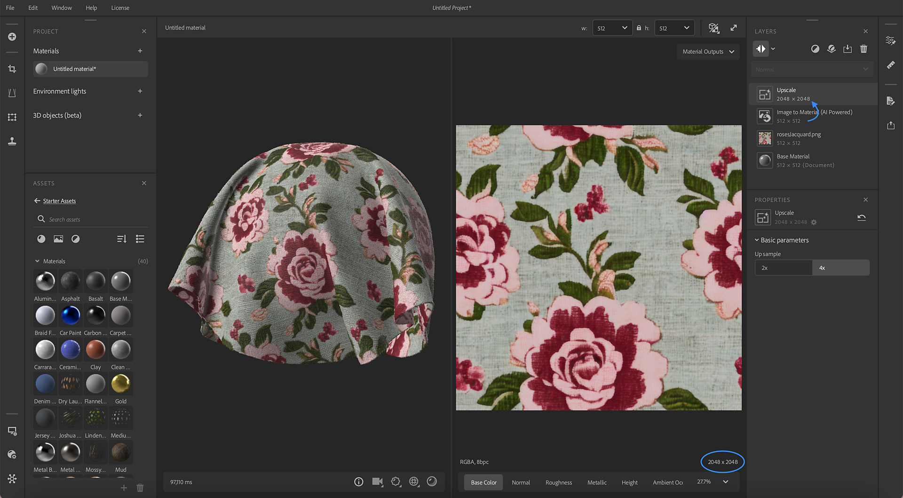
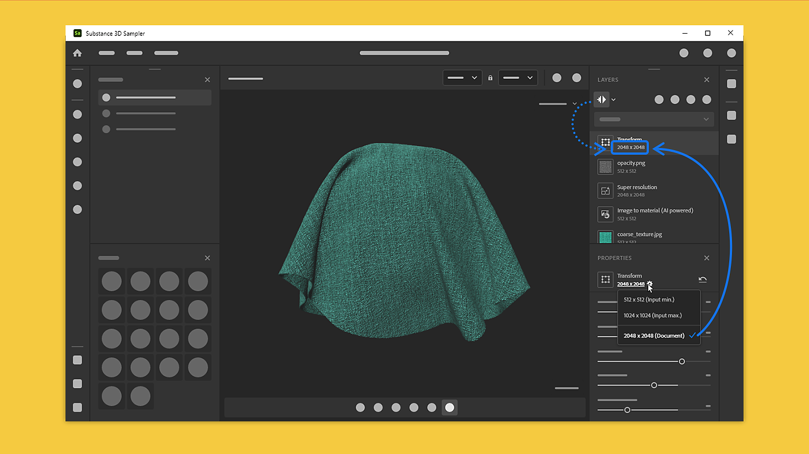

# バージョン4.2

<b>Substance 3D Sampler 4.2</b>は、新しいAIを利用したバージョンの<b>画像をマテリアルに提供する</b>と、新しい<b>AIアップスケール</b>機能を提供します。 このバージョンでは、レイヤーごとの解像度を完全に制御できます。

*リリース日： 2023年9月5日*

## 画像からマテリアル – 新しいバージョン

「画像をマテリアルに変換」を選択すると、1つの画像からマテリアルチャンネル（base color、ラフネス、通常、ディスプレイスメント、メタリック）が生成されます。

「マテリアルする画像」の更新バージョンでは、マテリアルの生成とサポートされるマテリアルの範囲が強化されています。

今では、Image to マテリアルはすべての種類のマテリアルに対してトレーニングされており、ファブリック、プラスチック、木材などに対してより良い結果を生み出しています。

今回のアップデートでは、すべてのチャンネルを正確にマテリアルし、範囲を自動で調整するためのパラメーターが追加されました。

## AIアップスケール

新しいアップスケールレイヤーにより、Samplerは素材（マテリアルまたは画像）の解像度に2を掛けるか4を掛けて、マテリアルまたは画像の機能を拡張します。

これにより、低解像度テクスチャの品質とディテールのレベルが向上し、テクスチャ拡大の際にマップ間のフィーチャの一貫性が維持されます。

アップスケールフィルターは、マテリアルのbase color、通常、Height、ラフネス、メタリックのチャンネルを拡張します。

結果の画質を最大にするには、データ（マテリアルと画像）に対してアップスケールフィルターを元の解像度で使用し、事前に解像度を変更しないようにします。

## レイヤー解像度

新しいレイヤー解像度システムでは、各レイヤーの解像度を完全に制御できます。 レイヤーには、ドキュメントサイズの解像度または下のレイヤーの解像度が適用されます。

解像度は各レイヤーに表示されるので、作品がマテリアルの解像度に与える影響を簡単に確認できます。

これにより、素材の品質を高めることができるだけでなく、アセットの作業中にパフォーマンスを向上させることができます。

## チュートリアル

## リリースノート

<b>4.2どら焼き</b>

*（リリース： 2023年9月5日）*

<b>追加済み</b>:

* [コンテンツ]大幅に改善されたマテリアル合成(AI)フィルターと明るさのフィルター
* [コンテンツ]新しいアップスケールフィルター
* [コンテンツ]切り抜きフィルターにダイナミックな出力解像度が追加されました。
* [マテリアル作成テンプレート]ドキュメントサイズ設定を追加します。
* [マテリアル作成テンプレート]新しい「切り抜きを追加」トグルボタンが追加されました。
* [マテリアル作成テンプレート]新しい「マテリアルをアップスケール」トグル
* [マテリアル作成テンプレート]読み込まれたイメージサイズを表示します
* [マテリアル作成テンプレート]読み込んだ画像が使用できない場合にフィードバックを送信する
* [マテリアル作成テンプレート]画像サイズに不整合がある場合に警告を表示する
* [マテリアル作成テンプレート]新しい警告とツールチップ
* [レイヤ] レイヤースタックのレイヤの解像度を表示します
* [レイヤー]レイヤーの計算解像度をドキュメントサイズまたは入力サイズに設定できるようになりました
* [レイヤー] レイヤースタックにレイヤーの解像度を表示します
* [レイヤー]レイヤー解像度ポリシーを必要に応じてドキュメントまたはレイヤー入力に切り替える
* [レイヤー]アップスケールフィルターが手動で追加されたときにユーザーに警告し、ドキュメントを提供する
* [レイヤー]線形アップスケールを行う際にユーザーに警告し、代わりにアップスケールフィルターを使用することを提案します
* [レイヤー]イメージをマテリアル(AI)レイヤーに変換する処理をすばやくキャンセルして、レイヤースタックを微調整する際のレンダリング時間を短縮できるようになりました
* [レイヤー] レイヤースタックを微調整する際のレンダリング時間を短縮するために、アップスケールレイヤーの計算をより迅速にキャンセルできるようになりました
* [書き出し]書き出されたテクスチャの解像度を上書きできます
* [書き出し]書き出しリストのチャンネルが並べ替えられました
* [書き出し]書き出すチャンネルリストにチャンネル解像度を表示します
* [アプリケーション] GPUアクセラレーションニューラルネットワークを有効または無効にする新しい環境設定
* [UI]解像度のドロップダウンの改善
* [UI] 変形、メッシュポストプロセス、ウィーブフィルター用の新しいアイコン
* [UI] 「共有」パネルの名前を「書き出し」に変更
* [スクリプト]書き出しAPIへのレイヤー出力解決サポートの追加
* [スクリプト]画像読み込みAPIに切り抜き、アップスケール、ドキュメントサイズを追加
* [オンボーディング]新規チュートリアル
* [オンボーディング]ようこそ画面と新機能の画面のコンテンツの更新
* [エンジン] Substance engineをバージョン9.0.1にアップデートします。

<b>修正済み：</b>

* [3D キャプチャ] アラインメント設定パラメーターの精度オプションの名前付けを改善します
* [アプリケーション] 16次元の非倍数を含む画像を読み込むと、クラッシュが発生する可能性があります
* [Application]プロジェクトパネルでアセットを複製すると、クラッシュが発生する
* [アプリケーション]プロジェクトパネルでアセットを切り替えるときにクラッシュが発生する
* [コンテンツ]Snowフィルターのカスタムマスクのペイントが正しく機能しない
* [表示されるパラメーター] マテリアルの切り替え時に表示されるパラメーターの変更内容が失われる場合がある
* [相互運用性]書き出しパネルからマテリアルを送信すると、クラッシュが発生する場合がある
* [レイヤー]単一の画像入力からマテリアルの入力に切り替えると、コンテンツに応じた塗りつぶしの計算が停止する
* マテリアルを含む環境光を複製すると、[レイヤー]クラッシュが発生する
* [レイヤー]画像ファイルの名前が変更されると、画像読み込みレイヤーのプロパティパネルに間違った画像名が表示される
* [レイヤ]非アクティブなレイヤにスピナーが表示される場合があります
* [レイヤー]画像読み込みレイヤーで、画像の出力方法を変更しても機能しない場合がある
* [レイヤ] [作成テンプレート]ウィンドウの誤字
* [UI] 3D ビューポートのオンボーディングツールチップにフォーカスの問題がある
* [UI]ファイル名が長すぎると、画像名がオーバーフローすることがあります
* [UI]消しゴムを使用する際のブラシツールバーのレイアウトに関する軽微な問題
* [UI]ビューアの設定パネルで、一部の言語で文字列が切り捨てられる
* [UI] ビューポートのツールヒントのポップアップが表示されているときに「スペース」を押すと、新しいプロジェクトが作成される
