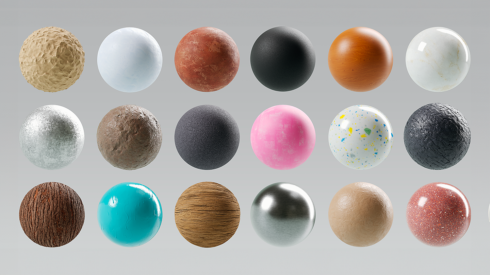
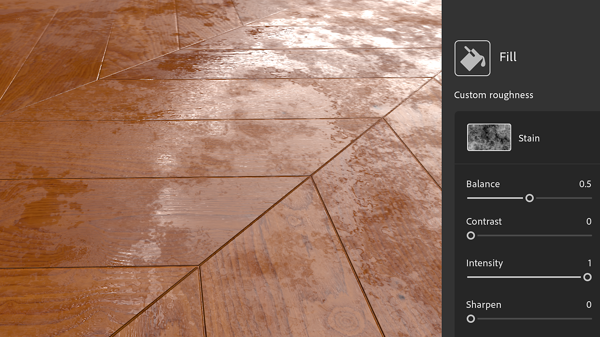
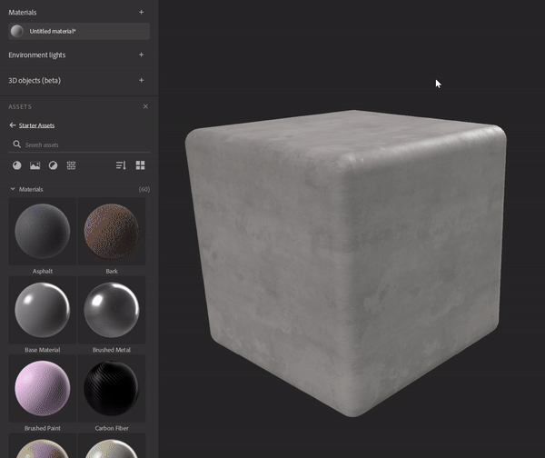
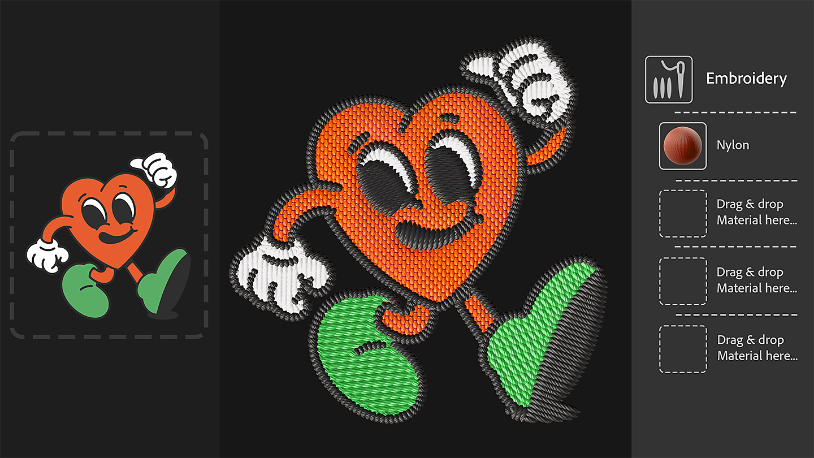
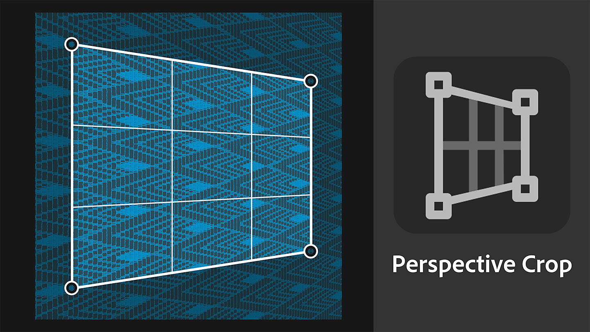
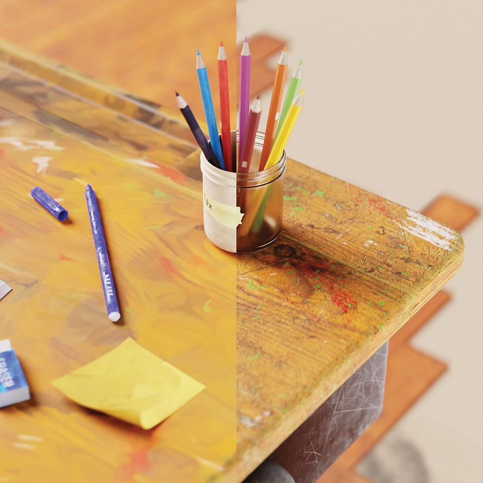
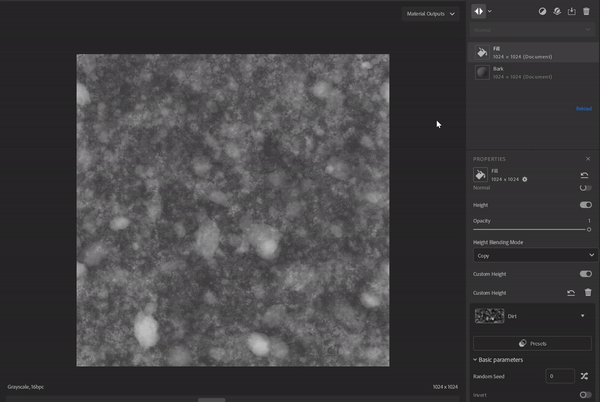
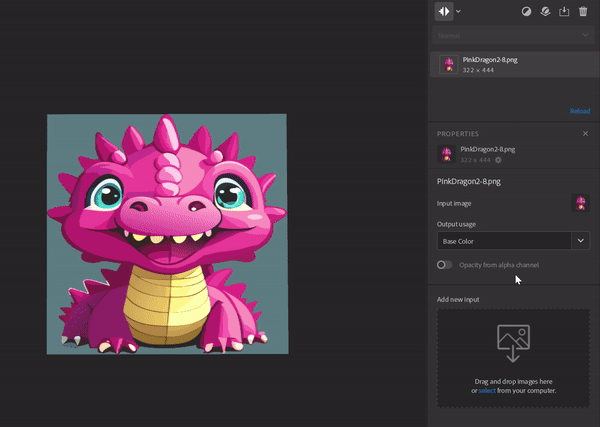

# バージョン4.3

<b>Substance 3D Sampler 4.3</b>には、新しいスターターコンテンツが導入されています。<b>テクスチャジェネレーター</b>、新しいバージョンの<b>刺しゅう</b>フィルター、<b>遠近法の切り抜き</b>ツールなどがあります。

*リリース日： 2024年1月25日*

## 新しいスターターアセットコンテンツ

Samplerに含まれるマテリアルが更新され、<b>工業デザイン</b>のワークフロー、<b>ファッション</b>のワークフロー、メディアやエンターテイメントで働く技術アーティストのニーズにより合わせて、テクスチャ作成の技術的側面をより細かく制御できるようになりました。

## テクスチャジェネレーター

新しいテクスチャジェネレータでは、<b>パラメトリックノイズ、パターン</b>および<b>の経年劣化</b>のオプションを使用して、マテリアルの作成をより詳細に制御できます。  生成された画像はマスクまたはチャンネルマップで使用でき、技術チームやクリエイティブチームはかつてないほど簡単にマテリアルデザインに協力できます。

新しいフィルタリングアイコンを使用して、テクスチャジェネレータのみを解析します。

## 刺繍

刷新された刺繍フィルターはステッチ精度を向上させ、最大8色をサポートします。 マテリアルの入力はレイヤースタックに戻り、パッチに他のメタリックを挿入できます。

## 遠近法の切り抜き

新しい遠近法切り抜きツールを使用すると、歪んだマテリアルや4つのコントロールポイントを使用したスキャンを切り抜いて、遠近法の斑点を除去し、タイル化可能な素材を取得できます。

## スタイル化

「スタイル適用」フィルターを使用すると、マテリアルのスタイルを設定して手描きの外観にすることができます。

## 塗りフィルターのブレンドモード

塗りつぶしフィルターのアップグレードにより、ブレンドモードが導入され、塗りつぶしの値、入力マップ、またはテクスチャジェネレーターを、下のレイヤーのチャンネル結果と乗算できるようになりました。

## 画像読み込みレイヤーの改善

「画像レイヤーを読み込み」で複数の画像を追加し、画像のアルファチャンネルから不透明度マップを作成することができます。

## リリースノート

*（リリース：2024年1月25日）*

<b>追加済み</b>:

* [アセット]新しいアセットタイプ：テクスチャジェネレータ
* [アセット]スターターアセットに含まれる新しいマテリアル
* [アセット]プロパティパネルの画像パラメーター用の新しいアセットピッカー
* [アセット]アセットパネルからプロパティパネルの画像ピッカーに、テクスチャジェネレーターをドラッグ&amp;ドロップします
* [アセット]オペレーティングシステムのファイルエクスプローラーからテクスチャジェネレータをドラッグアンドドロップする
* [アセット]フィルターを使用すると、画像入力のユーザタグを介してフィッティングジェネレーターを提案できます
* [アセット] テクスチャ生成機能では、どのフィルターを使用するかをuserタグで指定できます
* [コンテンツ]新しい遠近法切り抜きフィルター
* [コンテンツ]新しいスタイル設定フィルタ
* [コンテンツ]塗りつぶしフィルターの描画モード
* [コンテンツ]刷新された刺繍フィルター
* [コンテンツ]更新されたペイントの回り込みフィルター
* [コンテンツ] テクスチャジェネレータをサポートするようにすべてのフィルタを更新しました
* [レイヤー] テクスチャジェネレーターの出力チャンネルをレイヤースタックに追加する際に選択できます
* [レイヤー] テクスチャジェネレーターでプリセットを簡単に一覧表示して適用できます。
* [レイヤ] テクスチャジェネレータのプレビューをイメージピッカーに表示します。
* [レイヤ] テクスチャジェネレータのパラメータを表示およびエクスポートできます
* [レイヤー] テクスチャの読み込み作成テンプレートを使用して1つの画像を読み込むときに、Base color使用量を割り当てる
* [レイヤー]プロパティパネルの画像ピッカーで、互換性のないファイルをドラッグ&amp;ドロップしようとすると、フィードバックが表示される
* [レイヤー]読み込んだ画像のアルファチャンネルから不透明度チャンネルを生成します
* [レイヤー]カテゴリを変更すると、画像からマテリアル(AI)への変換処理が高速になります
* [レイヤ]作成テンプレートを使用した後、最も関連性の高いレイヤを選択します
* [レイヤー]位置ウィジェットを「詳細パラメーター」グループのスライダーで微調整できるようになりました
* [書き出し]キューに未加工の数字ではなくパーセンテージで表示する
* [相互運用性] Painterに送信するときに、不透明度チャンネルがアルファチャンネルとして認識されるようになりました。
* [アプリケーション]ハードウェア情報を表示および保存するための新しいダイアログ
* [Application]各プロジェクトのデフォルトのHeightスケールを変更する新しい環境設定
* [アプリケーション]古いアセットの表示方法を改善する
* [スクリプト]新しいasset.documentResolution()およびasset.setDocumentResolution()関数
* [スクリプト]新しいselect\_asset()関数
* [スクリプティング]テクスチャジェネレータ用Python API
* [スクリプト] get\_project\_assets()が3Dオブジェクトを返すようになりました
* [UI]アセットのサムネールサイズをアセットパネルで変更できる
* [UI] ビューポート表示アイコンの更新

<b>修正済み：</b>

* [2D ビュー]マウスホイールによるズームが244%でブロックされる
* [Application]グラフィックAPIの初期化開始時にクラッシュが発生する
* [アプリケーション]プロジェクト名に#文字が含まれているとクラッシュする
* [Application]古いプロジェクトを開くときにクラッシュが発生する可能性があります
* [Application]現在のプロジェクトを再度開くと、クラッシュが発生する可能性があります
* [アプリケーション]一部のプロジェクト変更が登録されず、保存されていない場合にプロジェクトを閉じると警告なしに失われる
* [書き出し] .sbs/.sbsarの書き出しの問題。同じ名前のファイルを複数使用した場合に発生する
* [書き出し]書き出したグレースケールイメージ .sbs/.sbsar ファイルのカラースペースが正しくない
* [Filters]不透明度ブレンドの動作の問題
* [レイヤー] .svgファイルが正しい解像度でレンダリングされない場合があります
* [パフォーマンス]ディスクに保存するプロジェクトが不要です
* [プロジェクト]古いプロジェクトを読み込むと、関連付けられたプリセットが読み込まれない
* [スクリプト]最初に挿入されたレイヤーのパラメーターを取得できない
* [UI]アセットをホバーしたときにプレビューポップアップが間違った場所や画面に表示されることがある
* [UI]ドッキングされていないパネルが表示され、スタートアップスクリーンの上で使用できる
