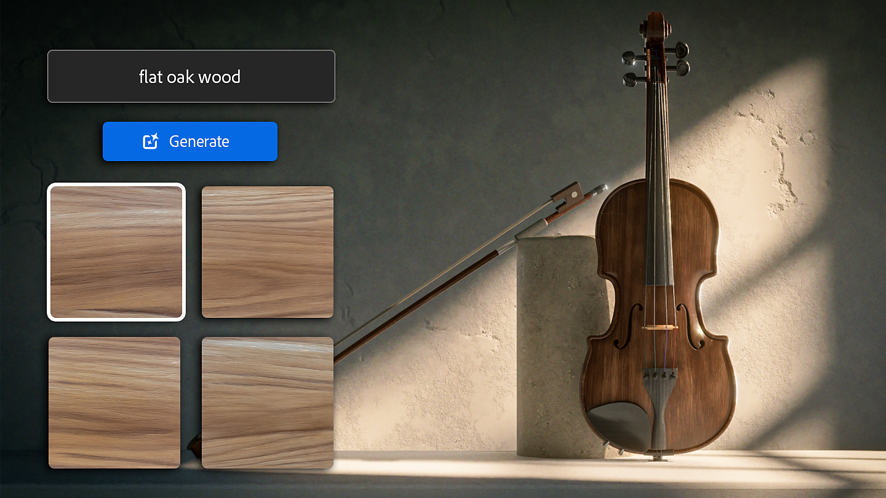
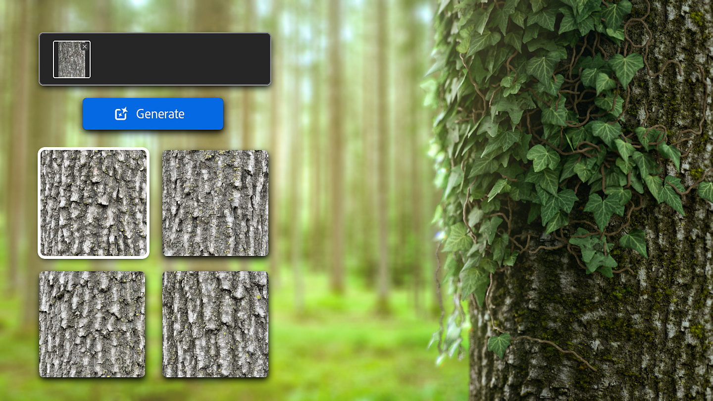
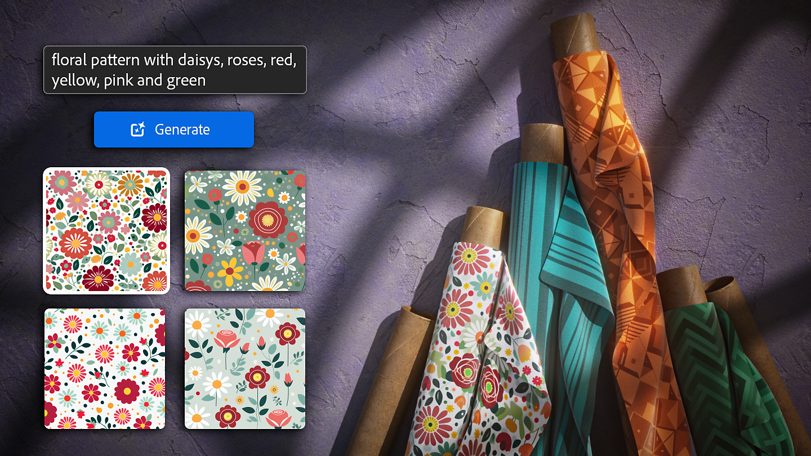

# バージョン4.4

<b>Substance 3D Sampler 4.4</b>では、テキストからテクスチャ、テキストからパターン、および画像からテクスチャという3つの新しい生成ワークフローがベータ版として導入されています。

<b>AI生成機能は、Adobeアカウントが必要なため、Adobe版</b>でのみ利用できます。 そのため、これらの機能はSteamでは<b>利用できません</b>。

*リリース日： 2024年5月23日*

## テキストからテクスチャ

テキストからテクスチャへの変換を使用すると、<b>テキストプロンプト</b>を使用してマテリアルを作成する新しい方法を試すことができます。 詳細なテキストの説明からタイル状のテクスチャを作成し、画像間フィルターまたは任意のSamplerフィルターを使用して結果を継続的にマテリアル化することで、独自の結果を作成できます。

## 画像からテクスチャ

画像からテクスチャへの変換を使用すると、非正方形および非タイリング画像に関係なく、<b>ユーザーの参照画像</b>からタイル状の正方形テクスチャを作成できます。 これにより、完全なプロンプトを記述しなくても、目的の結果に近づけることができます。\
画像からテクスチャへの変換は、既に作成したコンテンツからバリエーションを作成することで、時間を節約することもできます。

## Text-to-pattern

テキストからパターンへの機能では、<b>テキストプロンプト</b>を使用して、正方形のタイリングパターンを作成します。 その後、布地の織りフィルターのbase colorとして使用してオリジナルの布地のマテリアルを作成し、パターンフィルターの入力として使用できます。

## リリースノート

*（リリース：2024年5月23日）*

<b>追加済み</b>:

* [Application] 3D キャプチャキャッシュが別のサブフォルダーに保存されるようになりました
* [Generative AI]画像からテクスチャ（ベータ版）
* [Generative AI]テキストをパターン化（ベータ版）
* [Generative AI]テキストからテクスチャ（ベータ版）
* [スクリプト]アセットに「resource」プロパティが追加されました
* [スクリプト]レイヤーに「output\_usages」プロパティが追加されました

<b>修正済み：</b>

* [Application]破損したプロジェクトファイルを開くときにクラッシュが発生する
* プロジェクトに破損したアセットが含まれていると、[Application]クラッシュが発生する
* [アプリケーション] Windowsでモニターのプラグを抜く際のクラッシュ
* [アプリケーション] Windowsタスクバーのアプリケーションアイコンが正しくない
* [アプリケーション]メイン構成ファイルが破損すると、ファイルが削除される場合がある
* [アプリケーション]パネルがポップアップの前に表示されます
* [コンテンツ] テクスチャジェネレータのサムネイルがぼやけている
* [書き出し] .sbs/.sbsarを書き出すと、読み込まれた画像から生成された不透明度チャンネルが壊れる
* [フィルター]入力レイヤーによっては、アップスケールがクラッシュする場合があります
* [Generative AI]サービスから予期しない結果を受け取ると、クラッシュする可能性がある
* 環境変数からプラグインを自動読み込みする際の[スクリプティング]クラッシュ
* [スクリプティング] APIを使用して出力の使用法を割り当てるときに考えられるクラッシュ
