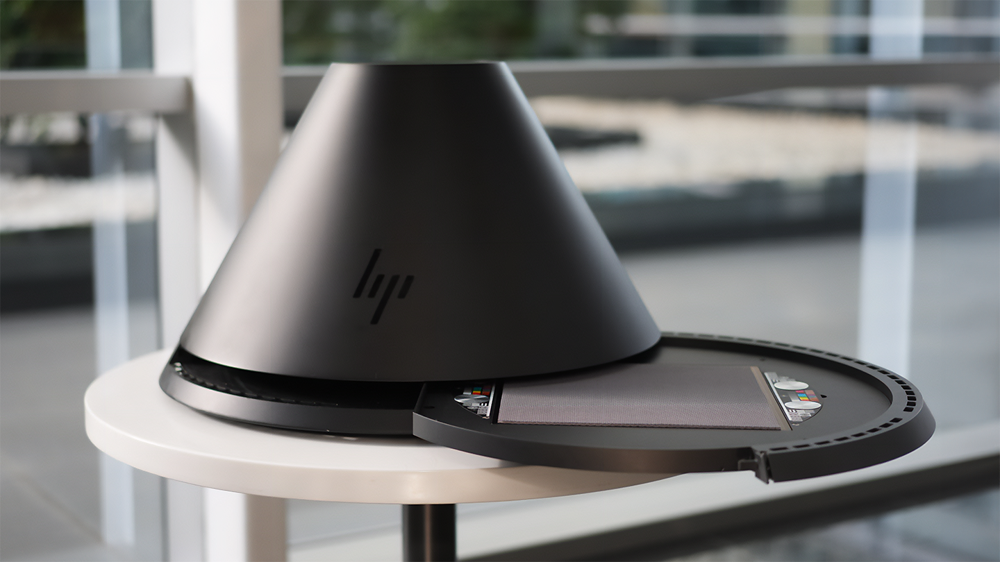

# バージョン5.0

<b>Substance 3D Sampler 5.0</b>は、高品質のスキャンとレンダリングを使用して、マテリアルデジタルツインを簡単に作成する方法を導入します。

主な新機能は次のとおりです。

## クイックアクション

Samplerのすべてのメインワークフローをワンクリックで開始し、レイヤースタックを準備できます。

詳細については、*[こちら](../interface/panels/quick-actions-panel.md)*&#x200B;をご覧ください。

## 新しいホーム画面レイアウト

すべてのプロジェクト、チュートリアルを検索し、ホームページから直接作業を開始できます。

詳細については、*[こちら](../interface/the-home-screen.md)*&#x200B;をご覧ください。

## 新しいレンダラー

視覚的な一貫性を向上させ、新しいマテリアルプロパティをサポートするリアルタイムトレースとパストレースのいずれかを選択します。 3Dビューから作業内容のスナップショットを直接保存します。

詳細については、*[こちら](../interface/2d-and-3d-viewport.md)*&#x200B;をご覧ください。

## HP Z Captisとの統合

HP Z CaptisとSubstance 3D Samplerを使用すれば、実世界の素材を数分でデジタル化できます。

この機能は、エンタープライズ、グループ版および教育機関向けアカウントでご利用いただけます。

詳細については、*[こちら](../pipeline-and-integrations/hp-z-captis-support/hp-z-captis-support.md)*&#x200B;をご覧ください。

## V5.0リリースノート

*（リリース：2025年2月20日）*

<b>追加済み</b>:

* [オンボーディング]学習コンテンツ、サンプルプロジェクト、クイックアクション、最近のプロジェクトにすばやくアクセスできる新しいホームページ。
* [オンボーディング]ホームページおよび専用パネルからアクセスできる新しいクイックアクションを使用して、すばやく作業を開始できます
* [オンボーディング] [コンテンツ]クイックアクションは、レイヤースタックに最もよく使用されるレイヤーを設定する定義済みのワークフローです
* [オンボーディング]新しいクイックスタートメニュー、クイックアクション、またはカスタムプロジェクトを使用して新しいプロジェクトを作成できます
* [オンボーディング]専用ボタンを使ってホームページから直接、空のプロジェクトを作成できる
* [3D View]Substanceエコシステム全体で新しいレンダリング機能（コーティング、光沢、半透明度、サブサーフェス散乱などのプロパティ）と視覚的な一貫性を提供する新しい高度なラスタライザーとパストラサー
* [3Dビュー]ビューア設定に3Dビューから直接アクセスできるようになりました
* [3Dビュー]レンダリングスナップショットをクリップボードまたはファイルに保存する機能
* [3Dビュー]グリッドを表示してシーンの原点を視覚化する
* [3Dビュー]地面を有効にして、影と反射をキャッチします
* [3Dビュー]グリッドの反射と不透明の度合いをコントロールします
* [3D キャプチャ]メッシュを地面に配置する
* [アプリケーション]アプリケーションの起動時にハードウェアの互換性を確認する
* [アプリケーション]クラッシュ発生直後にクラッシュレポートウィンドウが開くようになりました
* [コンテンツ]サンプルプロジェクトを開いて簡単に開始できます
* [書き出し] Adobe Standard MaterialシェーダをUSDファイルに書き出す
* [Generative AI] Image to Textureワークフローで画像を入力として使用する場合は、「推測しない」タグをオンにします。
* [プロジェクト]サムネールはプロジェクトファイルに保存され、プロジェクトをすばやく開くことができます
* [プロジェクト]環境設定で、異なるモード（キャッシュなし、ライトキャッシュ、フルキャッシュ）でプロジェクトファイル内にキャッシュデータを保存するように設定する
* [スクリプティング] [変更の中断] QtをQt6.15に移行する – 既存のプラグインの互換性に影響を与える
* [スクリプト]デフォルトのプラグインとスクリプトフォルダーがドキュメントフォルダーに追加されました
* [スクリプティング]メインのSamplerパネルとの視覚的な一貫性を保つプラグイン用の新しいUI
* [スクリプティング] Access 2のプラグイン例を使用して、Samplerプラグインの機能を見つける
* [スクリプティング]新しいopen\_3d\_catpure()関数
* [スクリプト]レイヤーを挿入するときに、ターゲット位置の上または下に挿入するかどうかを制御します

<b>修正済み：</b>

* [3D キャプチャ] macOSでオブジェクトキャプチャを開始できない場合にクラッシュする
* [アプリケーション]終了時にクラッシュする
* [アプリケーション]プロジェクトパネルへのアセットの追加中に終了時にハングする
* [アプリケーション]プロジェクトアセットの名前を変更すると、Enterキーを押さない限り機能しない
* [アプリケーション]取り消しおよびやり直しのメニュー項目が、必要な場合に無効にならない。
* [アセット]アセットパネルの「すべてのライブラリ」セクションからアセットを削除できない
* [コンテンツ]アトラス作成 – 既存の不透明度マップを使用します（存在する場合）
* [コンテンツ]カラーIDブレンド – 基本色の色の選択を修正します。
* [レイヤ]ジェネレータを使用する際に無駄な計算を避ける
* [レイヤ]ジェネレータをツイークすると、必要以上に多くの計算が実行される可能性があります
* [パフォーマンス] GPUメモリ管理の改善
* [パフォーマンス]アプリの再起動時にレンダーキャッシュが使用されない場合がある
* [リソース]アセットパネルに読み取り専用ファイルが表示されない
* [スクリプティング]別のレイヤーの追加後にレイヤーを再利用できるようにする
* [スクリプティング] 1つのスクリプトでレイヤースタック構造を数回変更すると失敗することがある

<b>削除済み：</b>

* [アプリケーション] .dngおよび.nef画像ファイルのサポートを削除
