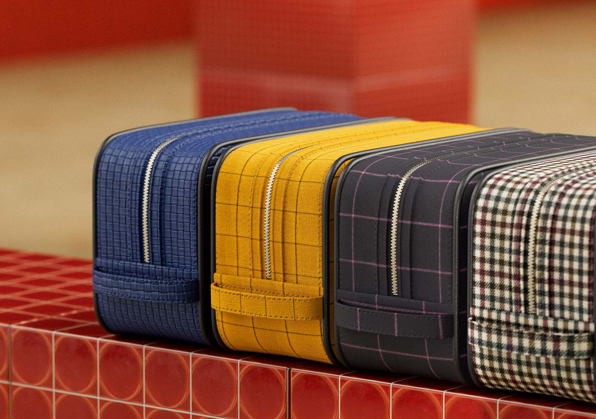
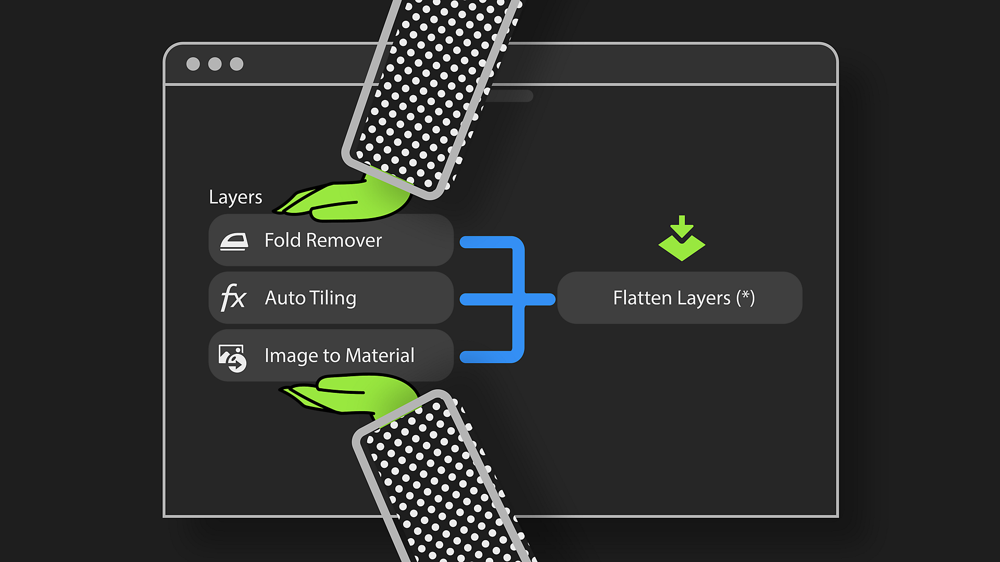
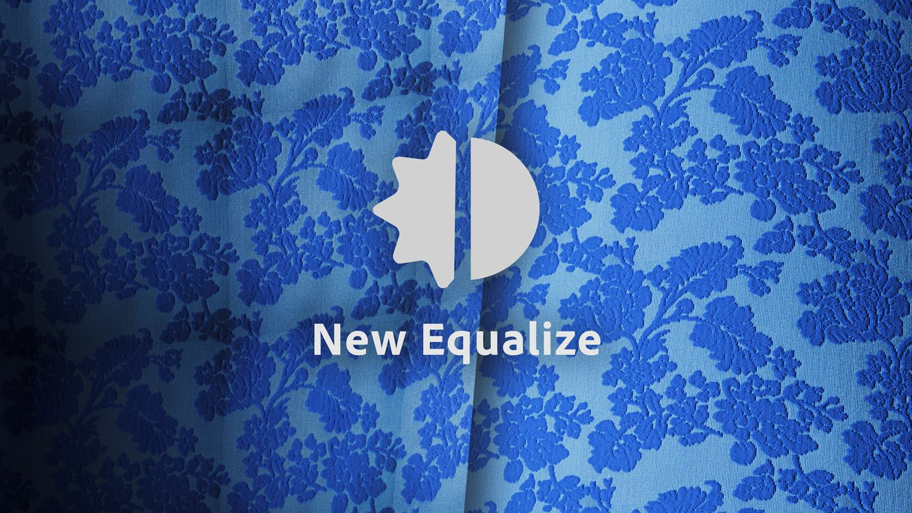
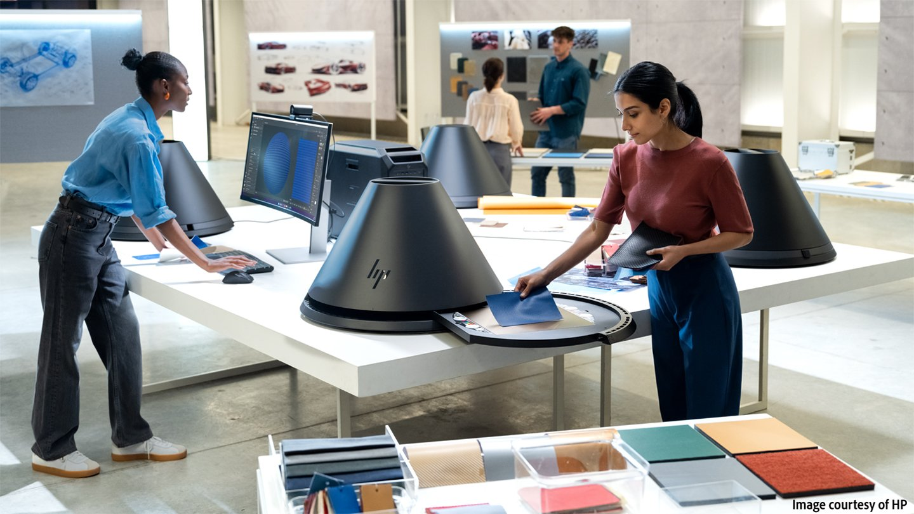

# バージョン5.1

<b>Substance 3D Sampler 5.1</b>の新しく改良されたツールを使用して、マテリアルを撮影してからデジタルツインを書き出すまでの時間を短縮しましょう。

主な新機能は次のとおりです。

## 構造化されたマテリアルを自動的にタイリング

シームレスなタイルを自動的に生成することで、ファブリックなどの構造化またはパターン化されたマテリアルの処理に要する時間を短縮できます。

詳細については、*[こちら](../filters/tools/auto-tiling.md)*&#x200B;をご覧ください。

## 効率的なレイヤーワークフロー

重なったレイヤーを1つの統合レイヤー内でマップの単一のセットに変形することで、統合レイヤーでパフォーマンスを向上させ、計算時間を短縮します。 ファイル名の変更や複製を行うことで、効率が向上します。

詳細については、*[こちら](../features-and-workflows/flatten-layers.md)*&#x200B;をご覧ください。

## スキャン処理のための強力なツール

強化されたイコライザーとクローンスタンプフィルターに加え、ファブリックの新しい自動折り目除去機能により、わずか数クリックで完璧なスキャンを行うことができます。マテリアルがどれほど複雑であっても同様です。

## HP Z Captis サポートを強化

Studioモードでラフネスマップの作成と自動物理サイズ検出を行うことで、これまで以上に詳細で正確なマテリアルデジタルツインが得られます。

## V5.1リリースノート

*（リリース：2025年8月7日）*

## 追加：

* [2D ビュー]ブラシサイズが現在のテクスチャの解像度に適応するようになりました
* [3D ビュー]環境設定で3Dレンダリングのネイティブ表示スケールを切り替え
* [Application] レンダリングエンジンの更新
* [キャプション]プレビュー中に「四角形を作成」可能を追加
* [Captis]自動物理サイズ検出
* [Captis]新しいアセットをキャプチャすると、新しいマテリアルが作成される
* [キャプション]ドロップダウンの解像度の選択を、最大領域のピクセル解像度ではなく、ピクセル/インチまたはセンチメートルに変更する
* [Captis] アラインメントのキャリブレーションに関するコンテキストヘルプ
* [Captis]ラフネスマップを生成する
* [キャプション]既定の調整ファイルが見つからない場合にユーザーに警告します
* [Filters]構造化されたマテリアルおよびスキャン用の自動タイリングフィルター
* [フィルタ]新しい折り抜きフィルタ
* [フィルター] クローンスタンプフィルター内の新機能
* [フィルター]イコライズフィルター内の新機能
* [レイヤー]レイヤーを統合する機能
* [レイヤー]レイヤーを右クリックしてレイヤーの名前を変更、複製、削除、または統合を行う際のコンテキストメニュー
* [オンボーディング]ようこそ画面と新機能の画面のコンテンツの更新
* [パフォーマンス]切り抜きフィルター使用時のパフォーマンスが向上しました
* [パフォーマンス] 3D ビューのメモリ使用量を増やす
* [パフォーマンス] 3Dビューの更新が速くなりました
* [物理サイズ]物理サイズが有効になっているときに、Substanceフィルターを操作しているときに「物理比で表示」を有効にする
* [物理サイズ]空のスタックに画像を読み込む場合は、画像比に一貫性のある解像度を提案します
* [クイックアクション]スキャン処理のための3つの新しいクイックアクション
* [スクリプト]レイヤーを統合するAPI
* [スクリプト]画像読み込みレイヤーの各画像のファイル名を取得する
* [スクリプティング]アセットの特定のチャンネルを有効/無効にする新しい機能
* [UI]レイヤーパネルのアイコンやボタンを新機能に合わせて再調整
* [UI] 環境光オーサリングの廃止について警告する

## 修正：

* [2Dビュー]Substanceフィルタを使用する場合、「物理比で表示」が機能しないことがある
* [3D キャプチャ] Svgファイルがファイルピッカーに一覧表示されるが、サポートされていない
* [3D ビュー] シェーダー設定の放射強度パラメータが機能しない
* [3D ビュー]新しいアセットを作成するときに、メッシュの位置が正しくない場合があります
* [3D ビュー]サポートされていないハードウェアでパストレーシングのレンダリングクラッシュに切り替える
* [アプリケーション]サイズを設定せずに手動メジャーポップアップを閉じると、アプリケーションがハングします
* [アプリケーション] クラッシュ
* [アプリケーション]デスクトップを表示するとWindowsがフリーズする（Windowsキー+ Dキーボードショートカット）
* [アプリケーション]言語切り替え時に発生する可能性のあるクラッシュ
* [キャプション]プレビューデータが無効な場合にクラッシュします
* [キャプション]ズームイン後に完全にズームアウトできない
* [Captis]一部のウィザード手順でローカリゼーションが見つからない
* [Captis] Captisを使用すると、終了時にクラッシュする可能性があります
* [Captis]デバイスに調整ファイルがない場合、スキャンが機能しない
* [フィルター] クローンスタンプフィルターを使用した場合のブラシプレビューが、テクスチャとブラシサイズによっては正しく表示されない場合があります
* [フィルター]アップスケールフィルターの使用後に誤った出力サイズが表示される
* [Filters]環境回転およびスタイル適用フィルターのアイコンが表示されない
* [フィルター]一部のフィルターを更新すると、正しくレンダリングされない場合があります
* [レイヤー] 2つのマテリアルをブレンドすると、最初のレンダリングが正しく行われない
* [レイヤー]更新が1つしかない場合でも、レイヤーを更新するボタンに「すべて更新」と表示される
* [レイヤー] レイヤースタックに画像を読み込む際の不要な計算
* [パフォーマンス] 法線マップ形式処理を改善してレンダリング時間を短縮します
* [物理サイズ]手動測定ポップアップが機能するのは、自動測定を実行した後だけです
* [物理サイズ] 物理サイズが有効になっているときに、書き出しポップアップで間違った書き出し解像度が表示される
* [クイックアクション]生成されたアセット名にローカライゼーションがありません
* [UI]カーソルを合わせたときにアセットのプレビューが表示されない
* [UI] 「デフォルト値にリセット」ボタンをクリックすると、一部のコントロールが壊れる場合がある
* [UI]プロジェクトの切り替え時にエラーメッセージがクリアされない
* [UI]アセットがない場合、ビューポートとプロパティパネルのマテリアル名が空白であることを確認します
* [UI]視点パラメーターの「デフォルト値にリセット」ボタンが機能しない
* [UI]デフォルト値にリセットボタンのオーバーラップ
* [UI]パネルのドッキングが解除されているときに、一部のボタンがクリックできない
* [UI] テクスチャのタイリングVパラメーターが、ビューアの設定と3D ビューの一部で非表示になっている

## 削除：

* [3D キャプチャ] 3D キャプチャのサポートを削除
* [Application] macOS x86サポートを削除する
